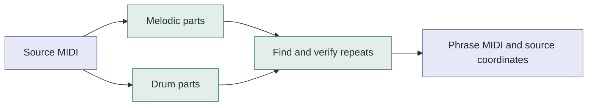
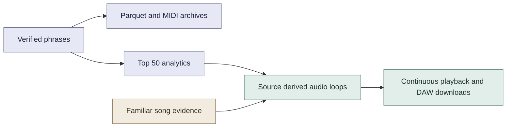

# SaMuGeD Earworms (Ostinato / Catchy musical hooks)

Recurring MIDI phrases with source coordinates and separate drum patterns.

[Dataset](https://huggingface.co/datasets/AlmazErmilov/samuged-recurring-phrases) · [Listen and download loops](https://huggingface.co/spaces/AlmazErmilov/samuged-earworms) · [Research note PDF](https://huggingface.co/datasets/AlmazErmilov/samuged-recurring-phrases/resolve/main/paper/samuged_recurring_phrases.pdf)

## Method



The primary `aligned_closed` release has **95,077 phrases**, 50,566 melodic and 44,511 percussion. The fixed window reference has 94,950 phrases. Both have complete artifact audits. Reference selection was replayed on all 16,995 successful sources, closed selection on a declared 256 source sample.

## What you can use



The Space includes top 50 listening collections, ten familiar song selections and [Tool’s ostinatos](docs/research/tool_motifs.md) with 69 riffs and 36 drum patterns from 28 songs. Source drums play by default where available. Tool offers 59 aligned three mode comparisons. Download 48 kHz stereo WAV, FLAC or loop MIDI. The separate atlas provides recurrence counts and note plots. Its audio uses the same SoundFont renderer. Downloaded Tool arrangements are interface supplements, outside the dataset.

There are **no listener labels** for these fragments. Repetition does not prove catchiness or recognition. Familiar song evidence applies to songs, not these exact MIDI fragments. Filename identities, search limits and duplicate arrangements affect coverage.

## Run locally

```sh
uv venv .venv --python 3.12
source .venv/bin/activate
uv pip install -r requirements-research.lock -r requirements-publication.lock
pytest -q
python -m samuged.cli build --source 'datasets/Lakh MIDI Clean' \
  --output research_local/my_run --algorithm aligned_closed \
  --workers 4 --percussion --recover-invalid-keys
```

Use a new output directory. Add `--limit 128` for a pilot. Source MIDI is not bundled.

[Methods and verification](docs/research/README.md) · [Publication and rendering](docs/publication/README.md) · [Release status](docs/research/DELIVERY.md) · [Consumer guide](docs/research/consumer_guide.md) · [Familiar song selection](docs/research/familiar_hooks.md)

## Inspiration

[](https://www.youtube.com/watch?v=eiknHyeNCpY)

## Authors

| Author | Contact |
| --- | --- |
| Peiyi Wu | [pewu10205@uit.no](mailto:pewu10205@uit.no) |
| Asle Fjæran Øren | [asleoren@gmail.com](mailto:asleoren@gmail.com) |
| Shayan Dadman | [shayan.dadman@uit.no](mailto:shayan.dadman@uit.no) |
| Almaz Ermilov | [almaz.ermilov@uit.no](mailto:almaz.ermilov@uit.no) |

[Dataset citation](CITATION.cff). Code uses [MIT](LICENSE). The derived dataset follows Lakh's declared [CC BY 4.0 collection license](https://colinraffel.com/projects/lmd/). Underlying composition and arrangement attribution is incomplete. No independent rights clearance is claimed. External evaluation datasets and original commercial recordings are excluded.
