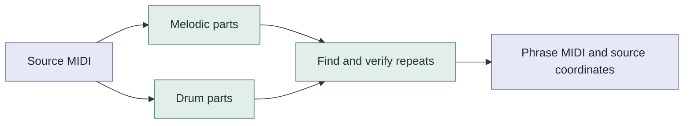
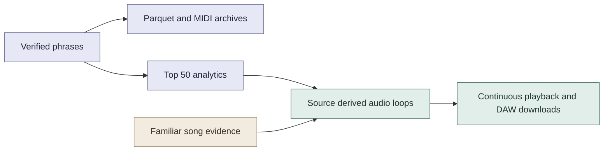
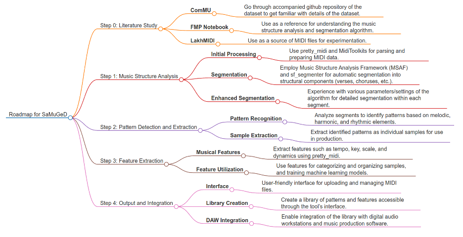

# SaMuGeD Earworms (Ostinato / Catchy musical hooks)

Recurring MIDI phrases with source coordinates and separate drum patterns.

SaMuGeD began as a MIDI sampling project: find repeated musical ideas, collect them as reusable phrases and explore them in music production. Earworms carries that idea into a dataset and a loop player.

[](https://huggingface.co/datasets/AlmazErmilov/samuged-recurring-phrases)
[](https://huggingface.co/spaces/AlmazErmilov/samuged-earworms)
[](https://huggingface.co/datasets/AlmazErmilov/samuged-recurring-phrases/resolve/main/paper/samuged_recurring_phrases.pdf)
[](https://github.com/AlgoritmiNarvik/SaMuGeD-Algoritmi-DrDreSampler-2024/actions/workflows/research-tests.yml)

## Method



The primary `aligned_closed` release has **95,077 phrases**, 50,566 melodic and 44,511 percussion. The fixed window reference has 94,950 phrases. Both have complete artifact audits. Reference selection was replayed on all 16,995 successful sources, closed selection on a declared 256 source sample.

## What you can use



The Space includes top 50 listening collections, ten familiar song selections and [Tool’s ostinatos](docs/research/tool_motifs.md) with 69 riffs and 36 drum patterns from 28 songs. Source drums play by default where available. Tool offers 59 aligned three mode comparisons. Download 48 kHz stereo WAV, FLAC or loop MIDI. The separate atlas provides recurrence counts and note plots. Its audio uses the same SoundFont renderer. Downloaded Tool arrangements are interface supplements, outside the dataset.

Start with the interactive Schism example to see repeated notes become a loop. All listening audio uses ColomboGMGS2 17.02 Vanilla through FluidSynth.

[Rendering notes](docs/research/instrument_rendering.md) include a reproducible six phrase comparison of complete instrument banks and MIDI engines.

There are **no listener labels** for these fragments. Repetition does not prove catchiness or recognition. Familiar song evidence applies to songs, not these exact MIDI fragments. Filename identities, search limits and duplicate arrangements affect coverage.

## Run locally

```sh
uv venv .venv --python 3.12
source .venv/bin/activate
uv pip install -r requirements-research.lock -r requirements-publication.lock
pytest -q
python -m samuged.cli build --source 'datasets/Lakh MIDI Clean' \
  --output research_local/my_run --algorithm aligned_closed \
  --workers 4 --percussion --recover-invalid-keys
```

Use a new output directory. Add `--limit 128` for a pilot. Source MIDI is not bundled.

[Methods and verification](docs/research/README.md) · [Publication and rendering](docs/publication/README.md) · [Release status](docs/research/DELIVERY.md) · [Consumer guide](docs/research/consumer_guide.md) · [Familiar song selection](docs/research/familiar_hooks.md)

## Project roadmap

The original roadmap connects music structure analysis, phrase extraction, feature search and DAW use. It records the project's starting ideas, not a list of completed features.



| Original direction | Where it stands |
| --- | --- |
| Find repeated phrases | The current dataset exports melodic and drum patterns with verified source occurrences. |
| Explore segmentation and phrase boundaries | [SF segmenter experiments](archived/Peiyi_trying_sth_sfsegmenter/) are retained. The current method uses its own candidate and boundary rules. |
| Group and search musical patterns | [SimilarMidis](SaMuGed-SimilarMidis/README.md) retains the earlier feature similarity application and clustering notebook. |
| Reuse phrases in music production | The player offers looping audio and MIDI downloads for DAWs. A dedicated DAW plugin is not part of this release. |

The [original planning notes](docs/legacy_project_notes.md) retain the earlier tasks on bar structure, note histograms, segment lengths and silence settings, alongside historical setup instructions.

## Inspiration

[](https://www.youtube.com/watch?v=eiknHyeNCpY)

## Authors

| Author | Contact |
| --- | --- |
| Peiyi Wu | [pewu10205@uit.no](mailto:pewu10205@uit.no) |
| Asle Fjæran Øren | [asleoren@gmail.com](mailto:asleoren@gmail.com) |
| Shayan Dadman | [shayan.dadman@uit.no](mailto:shayan.dadman@uit.no) |
| Almaz Ermilov | [almaz.ermilov@uit.no](mailto:almaz.ermilov@uit.no) |

## Citation

Use **Cite this repository** in the GitHub sidebar, or copy the BibTeX below. [Download BibTeX](CITATION.bib) · [Citation metadata](CITATION.cff).

```bibtex
@misc{wu2026samuged,
  author = {Wu, Peiyi and Øren, Asle Fjæran and Dadman, Shayan and Ermilov, Almaz},
  title = {{SaMuGeD} Earworms (Ostinato / Catchy musical hooks)},
  year = {2026},
  version = {0.1},
  url = {https://huggingface.co/datasets/AlmazErmilov/samuged-recurring-phrases},
  note = {Research dataset release}
}
```

## License

Code uses [MIT](LICENSE). The derived dataset follows Lakh's declared [CC BY 4.0 collection license](https://colinraffel.com/projects/lmd/). Underlying composition and arrangement attribution is incomplete. No independent rights clearance is claimed. External evaluation datasets and original commercial recordings are excluded.
