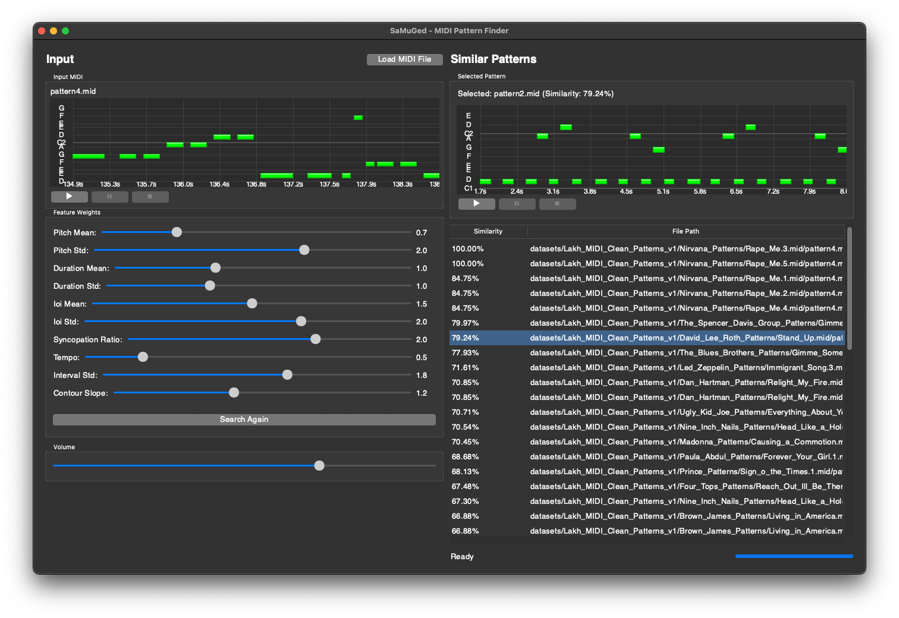

# SaMuGed (Similar MIDI Generator & Editor)

A Python application for finding similar MIDI patterns using feature-based similarity search.

<div align="center">
<h3>SimilarPatterns GUI v1.1.3</h3>


</div>

## Development Progress

The project maintains detailed progress tracking in `docs/PROGRESS.md`. Current version is v1.1.6 with the following major milestones achieved:

- Core MIDI feature extraction and similarity search ✓
- Feature weights system and GUI ✓
- MIDI playback with controls ✓
- Dataset caching system ✓
- Piano roll visualization ✓
- Advanced playback state management ✓

Upcoming planned versions:
- v1.1.7: Piano Roll Fine-tuning
- v1.2.0: Advanced Playback Features
- v1.3.0: Enhanced MIDI Processing
- v1.4.0: Advanced Features

For detailed progress tracking, feature status, and development plans, please refer to `docs/PROGRESS.md`.

## Features

- MIDI feature extraction (pitch, rhythm, tempo analysis)
- Configurable feature weights for customized similarity search
- User-friendly GUI with interactive controls
- Real-time similarity search results
- Support for large MIDI datasets

## Installation

1. Clone the repository:
   ```bash
   git clone https://github.com/AlgoritmiNarvik/SaMuGeD-Algoritmi-DrDreSamplerAI-2024
   cd SaMuGed-SimilarMidis
   ```

2. Create a virtual environment (recommended):
   ```bash
   python -m venv venv
   source venv/bin/activate  # On Windows: venv\Scripts\activate
   ```

3. Install dependencies:
   ```bash
   pip install -r requirements.txt
   ```

## Usage

1. Dataset Setup:
   - Create the directory `SaMuGed-SimilarMidis/datasets` if it doesn't exist
   - Place your MIDI dataset in `SaMuGed-SimilarMidis/datasets/Lakh_MIDI_Clean_Patterns_v1/`
   - For now we use dataset Lakh_MIDI_Clean_Patterns_v1 form Asle Øren that you can find here [Lakh_MIDI_Clean_Patterns_v1.zip](https://universitetetitromso.sharepoint.com/:u:/s/O365-AIMusicExpo2024/ETsYg7LmqI5LtZEQOsQR0FsB8mK_bY02lymu1OI_9lb7oA?e=5RFmuH) (access internal only if you have UiT account)
   - Without a properly placed dataset, the application will not be able to perform similarity searches

2. Run the application:
   ```bash
   python app.py
   ```

3. Use the interface to:
   - Adjust feature weights using sliders
   - Load a query MIDI file
   - View similarity search results

## Requirements

See `requirements.txt` for detailed dependencies.

## Project Structure

```
├── app.py              # Main application and GUI
├── piano_roll.py       # Piano roll visualization component
├── midi_player.py      # MIDI playback functionality
├── database.py         # Dataset handling and similarity search
├── feature_calculator.py # MIDI feature extraction and analysis
├── config.py           # Configuration settings
├── requirements.txt    # Project dependencies
├── docs/              # Documentation
│   ├── PROGRESS.md    # Development progress tracking
│   └── Clustering_repeated_motifs_v040_clean.ipynb  # Clustering analysis notebook (my reference for code)
├── datasets/          # MIDI dataset directory
│   └── Lakh_MIDI_Clean_Patterns_v1/  # Main dataset location
└── cache/            # Cache directory for processed data
```

Key Components:
- `app.py`: Main application entry point with GUI implementation
- `piano_roll.py`: Handles visualization of MIDI patterns in piano roll format
- `midi_player.py`: Manages MIDI file playback and audio output
- `database.py`: Handles dataset operations and similarity search functionality
- `feature_calculator.py`: Extracts and processes MIDI features for analysis
- `config.py`: Contains configuration parameters and settings
- `cache/`: Stores processed dataset information for faster loading

## Logging & Debugging

This application integrates logging across all modules for diagnostics and troubleshooting. Detailed logs capture events, errors, and state changes from modules including `midi_player.py`, `feature_calculator.py`, `database.py`, and others. Log files (e.g., `midi_player.log`) provide critical insights, which is particularly helpful for diagnosing issues.

Developers and users can refer to these logs to monitor the application's performance and to troubleshoot problems.
