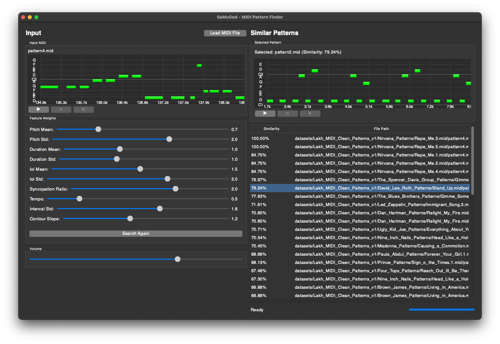

# SaMuGed (Similar MIDI Finder)

A Python application for finding similar MIDI patterns using feature-based similarity search.

> **Platform Support Note:** The Docker web application version is recommended for all users (check [web application section (using docker)](#using-docker-recommended)). The desktop application works well on macOS systems but has display issues and functionality problems on Windows. The Windows desktop version is currently under development with medium/low priority.

## Contents
- [SaMuGed (Similar MIDI Finder)](#samuged-similar-midi-finder)
  - [Contents](#contents)
  - [Development Progress](#development-progress)
  - [Features](#features)
  - [About algorithm inside SimilarMidis](#about-algorithm-inside-similarmidis)
    - [Similarity Detection Algorithm (overview)](#similarity-detection-algorithm-overview)
  - [Installation Options](#installation-options)
    - [Desktop Application (Original)](#desktop-application-original)
    - [Web Application](#web-application)
      - [Using Docker (RECOMMENDED)](#using-docker-recommended)
      - [Manual Web Setup](#manual-web-setup)
  - [Usage](#usage)
    - [Dataset Setup (Required for All Versions)](#dataset-setup-required-for-all-versions)
    - [Dataset Creation Process](#dataset-creation-process)
    - [Desktop Application](#desktop-application)
    - [Web Application](#web-application-1)
  - [Requirements](#requirements)
  - [Project Structure](#project-structure)
  - [Logging \& Debugging](#logging--debugging)

<div align="center">
<h3>SimilarPatterns GUI v1.1.7+</h3>


</div>

## Development Progress

The project maintains progress tracking in `docs/PROGRESS.md`. Current version is v1.1.7+ with the following major milestones achieved:

- Core MIDI feature extraction and similarity search ✓
- Feature weights system and GUI ✓
- MIDI playback with controls ✓
- Dataset caching system ✓
- Piano roll visualization ✓
- Playback state management ✓
- Web interface and containerization ✓

## Features

- MIDI feature extraction (pitch, rhythm, tempo analysis)
- Configurable feature weights for customized similarity search
- User-friendly GUI with interactive controls
- Real-time similarity search results
- Support for large MIDI datasets
- Cross-platform support via web interface and Docker

## About algorithm inside SimilarMidis 

The core algorithm for finding similar MIDI patterns is thoroughly documented in the [Clustering Repeated Motifs notebook](https://github.com/AlgoritmiNarvik/SaMuGeD-Algoritmi-DrDreSamplerAI-2024/blob/main/SaMuGed-SimilarMidis/docs/Clustering_repeated_motifs_v040_clean.ipynb). This Jupyter notebook provides:

- Detailed explanation of the similarity detection algorithm
- Feature extraction techniques for MIDI analysis
- Mathematical foundations for pattern matching
- Clustering methodology for identifying repeated musical motifs
- Code examples with thorough annotations

### Similarity Detection Algorithm (overview)

The similarity detection algorithm works through a multi-step process:

1. **Feature Extraction**: Each MIDI file is analyzed to extract 8 key features:
   - Tempo (BPM)
   - Pitch mean and standard deviation (captures melodic characteristics)
   - Note duration mean and standard deviation (captures articulation style)
   - Inter-onset interval mean and standard deviation (captures rhythm spacing)
   - Syncopation ratio (captures rhythmic complexity)

2. **Vector Space Representation**: These features create an 8-dimensional vector for each MIDI pattern, standardized to balance feature importance.

3. **Efficient Similarity Search**: Using Facebook AI Similarity Search (FAISS), the application builds an index of all patterns and efficiently finds the closest matches based on Euclidean distance.

4. **Weighted Customization**: Users can adjust feature weights to prioritize certain musical aspects (melody, rhythm, etc.) when searching for similar patterns.

When a query MIDI is provided, the system extracts its features, finds the nearest neighbors in the vector space, and returns the most similar patterns ranked by similarity score.

## Installation Options

### Desktop Application (Original)

1. Clone the repository:
   ```bash
   git clone https://github.com/AlgoritmiNarvik/SaMuGeD-Algoritmi-DrDreSamplerAI-2024
   cd SaMuGed-SimilarMidis
   ```

2. Create a virtual environment (recommended):
   ```bash
   python -m venv venv
   source venv/bin/activate  # On Windows: venv\Scripts\activate
   ```

3. Install dependencies:
   ```bash
   pip install -r requirements.txt
   ```

### Web Application

The web version allows you to run SaMuGed on any device with a web browser.

#### Using Docker (RECOMMENDED)

1. Install [Docker](https://www.docker.com/get-started) and [Docker Compose](https://docs.docker.com/compose/install/)

2. Build and run the container:
   ```bash
   cd SaMuGed-SimilarMidis
   docker-compose up -d
   ```

3. Access the application at `http://localhost:5000`

#### Manual Web Setup

1. Follow the installation steps for the desktop application

2. Install additional dependencies:
   ```bash
   pip install flask gunicorn matplotlib
   ```

3. Run the web server:
   ```bash
   cd SaMuGed-SimilarMidis
   PYTHONPATH=. flask --app web/app.py run
   ```

4. Access the application at `http://localhost:5000`

## Usage

### Dataset Setup (Required for All Versions)

- Create the directory `SaMuGed-SimilarMidis/datasets` if it doesn't exist
- Place your MIDI dataset in `SaMuGed-SimilarMidis/datasets/Lakh_MIDI_Clean_Patterns_v1/`
- For now we use dataset Lakh_MIDI_Clean_Patterns_v1 form Asle Øren that you can find here [Lakh_MIDI_Clean_Patterns_v1.zip](https://universitetetitromso.sharepoint.com/:u:/s/O365-AIMusicExpo2024/ETsYg7LmqI5LtZEQOsQR0FsB8mK_bY02lymu1OI_9lb7oA?e=5RFmuH) (access internal only if you have UiT account)
- Without a properly placed dataset, the application will not be able to perform similarity searches
- Documentation on how the dataset was created is available in the [dataset creation scripts directory](https://github.com/AlgoritmiNarvik/SaMuGeD-Algoritmi-DrDreSamplerAI-2024/tree/main/testing_tools/test_scripts/asle_scripts)

### Dataset Creation Process

The Lakh_MIDI_Clean_Patterns_v1 dataset was created using a specialized pattern detection system that identifies repeating musical patterns or motifs within MIDI files. The process involves:

1. **Segmentation**: Dividing each MIDI track into segments based on natural breaks in the music (silence between notes)
2. **Pattern Detection**: Identifying repeating note sequences by comparing pitch and duration
3. **Deduplication**: Filtering similar patterns to prevent duplicates
4. **Output Generation**: Saving each unique pattern as a separate MIDI file

The dataset is organized hierarchically by artist, song, and instrument, making it easy to navigate and use for similarity search. Each pattern contains at least one musical bar and preserves the original tempo, time signature, and other MIDI metadata.

For detailed information about the pattern detection algorithm and dataset creation process, see the [full documentation](https://github.com/AlgoritmiNarvik/SaMuGeD-Algoritmi-DrDreSamplerAI-2024/tree/main/testing_tools/test_scripts/asle_scripts).

### Desktop Application

Run the desktop application:
```bash
python app.py
```

### Web Application

See the [Web Application README](web/README.md) for detailed instructions.

## Requirements

See `requirements.txt` for detailed dependencies.

## Project Structure

```
/SaMuGeD-Algoritmi-DrDreSamplerAI-2024/
├── SaMuGed-SimilarMidis/   # Main project folder
│   ├── app.py              # Main desktop application and GUI
│   ├── piano_roll.py       # Piano roll visualization component
│   ├── midi_player.py      # MIDI playback functionality
│   ├── fluidsynth_player.py # Alternative player implementation
│   ├── database.py         # Dataset handling and similarity search
│   ├── feature_calculator.py # MIDI feature extraction and analysis
│   ├── config.py           # Configuration settings
│   ├── requirements.txt    # Project dependencies
│   ├── web/                # Web application files
│   │   ├── app.py          # Flask web server
│   │   ├── templates/      # HTML templates
│   │   ├── Dockerfile      # Docker configuration
│   │   └── README.md       # Web version documentation
│   ├── docker-compose.yml  # Docker Compose configuration
│   ├── docs/               # Documentation
│   │   └── PROGRESS.md     # Development progress tracking
│   ├── datasets/           # MIDI dataset directory
│   │   └── Lakh_MIDI_Clean_Patterns_v1/  # Main dataset location
│   ├── soundfonts/         # Sound font files for MIDI playback
│   ├── cache/              # Cache directory for processed data
│   └── docs/                   # Repository-level documentation
│       └── Clustering_repeated_motifs_v040_clean.ipynb  # Clustering analysis notebook
├── web/                    # Web components outside the main project folder

/testing_tools/          # Testing and dataset creation utilities
├── test_scripts/
│       └── asle_scripts/   # Dataset creation scripts and documentation
```

Key Components:
- `app.py`: Main desktop application entry point with GUI implementation
- `piano_roll.py`: Handles visualization of MIDI patterns in piano roll format
- `midi_player.py`: Manages MIDI file playback and audio output
- `fluidsynth_player.py`: Alternative player implementation
- `database.py`: Handles dataset operations and similarity search functionality
- `feature_calculator.py`: Extracts and processes MIDI features for analysis
- `config.py`: Contains configuration parameters and settings
- `web/app.py`: Flask web server for the web interface
- `docker-compose.yml`: Docker configuration for containerized deployment
- `cache/`: Stores processed dataset information for faster loading

## Logging & Debugging

This application integrates logging across all modules for diagnostics and troubleshooting. Detailed logs capture events, errors, and state changes from modules including `midi_player.py`, `feature_calculator.py`, `database.py`, and others. Log files (e.g., `midi_player.log`) provide critical insights, which is particularly helpful for diagnosing issues.

Developers and users can refer to these logs to monitor the application's performance and to troubleshoot problems.

