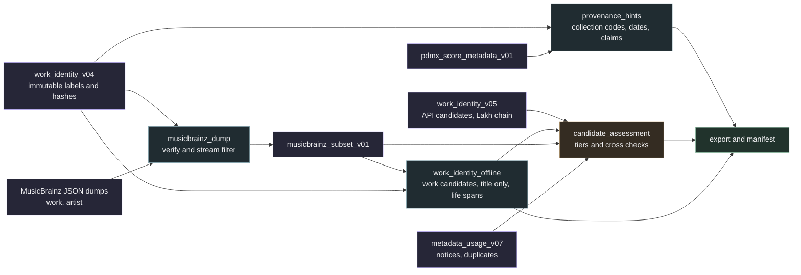

# Identity enrichment with offline MusicBrainz dumps

Date: 2026-10-07. Branch `feature/identity-enrichment-offline`.

## Problem

The work identity queue has 208 212 sources. After the bounded MusicBrainz API runs, 809 sources carry unreviewed candidates, 59 095 are pending and 145 055 PDMX sources have a title but no usable creator label. The public API allows one request per second per application, so finishing the pending queue alone would take 30 to 40 hours and title only lookups for 63 288 distinct titles would add about 20 hours with low expected precision.

MusicBrainz publishes full JSON dumps under CC0. The work dump (687 MB compressed, snapshot 2026-10-03) contains titles, aliases, ISWCs, composer and lyricist relations with artist ids and performance relations. The artist dump (1.7 GB) contains life spans. Filtering both streams against our normalized title and creator sets resolves every work kind lookup offline, gives whole database namesake counts for ambiguity and covers composer life dates for term estimates. The recording JSON dump is incomplete (34 MB), so Lakh recording lookups stay on the API.

## Decisions

1. The working index `work_identity_v05.sqlite` remains the only mutable store fed by the API, under the pinned runtime `identity_lookup_runtime_v04` and the original limits. A local supervisor chains bounded runs for the Lakh dataset only, archives receipts under run numbers, verifies ownership, hashes, integrity, storage and runtime code between runs and honours a `PAUSE` flag. Nothing else opens v05 while the chain runs.
2. All new evidence goes to separate sidecar indexes bound to the immutable `work_identity_v04.sqlite` by `source_key` and `source_sha256`. Each module owns one index and records input hashes in a `provenance` table.
3. Evidence from dumps records the dump name, archive sha256, timestamp and replication sequence instead of a request URL and retrieval date. The matching rules stay those of `work-candidates-v3`: normalized title or alias agreement plus creator agreement by normalized tokens or initials. The policy label changes so dump results are never confused with API results.
4. No result is promoted to a verified identity or to rights clearance. Title only matches are `title_only_candidate_requires_review`. Term estimates from composer death years are estimates with the rule named, not clearance.
5. The dump archives are temporary. They are verified against the signed `SHA256SUMS`, filtered and then deleted. The 10 GiB storage reserve stays in force.

## Components

### musicbrainz_dump

Verifies archive hashes against `SHA256SUMS`, reads `TIMESTAMP`, `REPLICATION_SEQUENCE` and `SCHEMA_SEQUENCE` from the tar, then streams `mbdump/work` and `mbdump/artist` line by line without extracting to disk. A work is kept when its normalized title or any alias is in the title set built from the queue. Namesake counts are recorded for every title in the set across the whole dump. An artist is kept when its id appears as a composer, writer, lyricist, librettist or arranger of a kept work, or when its normalized name, sort name or alias is in the creator set built from queue creators and cleaned PDMX score composer claims. Tags, genres, ratings and annotations are excluded.

### work_identity_offline

Applies the `work-candidates-v3` rules to every work kind source against the subset. Sources with a title and a creator produce `work_candidates` rows in the same shape as the API index, with evidence naming the dump and policy `work-candidates-v3-dump`. Sources with a title only produce `title_only_candidates` rows with every namesake work and its writers, the namesake count and the review status. Distinct creators are matched to artists with the same agreement rules; life spans produce `term_estimates` with the rule `life_plus_70` and a status of likely expired, likely in term or unknown. Ambiguous names are recorded as ambiguous, never resolved by popularity.

### provenance_hints

Offline extraction from titles, subtitles, composer and artist claims and upstream declarations: collection style codes such as `JJo6.15`, year claims and life dates, collector attributions such as `after Mr. Beamish`, unattributed markers in several languages, standardized title claims, dance instructions, setting numbers, external archive references and the uploader public domain declaration. Each source receives a claim class and a search route. Collection codes are stored as codes; mapping them to named manuscripts needs review and is not asserted.

The `creator_kind` classifier in `track_metadata` learns the unknown author markers it currently misses (`Urheber unbekannt`, `?`, `unknown`). These are label corrections for the next index build, not changes to the running index.

### candidate_assessment

Reads candidates from the API index at a chain pause and from the offline index, and assigns tiers: a single work with canonical title and full creator agreement, a single work with weaker agreement or many namesakes, several works, or a conflict. Cross checks use MIDI copyright notice text against MusicBrainz writer names and compare candidates across sources that share a musical hash. Results are assessments with signals, never review decisions.

## Operations

- Chain supervisor: `research_local/corpus_expansion_v02/run_work_identity_chain.py` with `run_work_identity_lakh.py`. Receipts archive as `work_identity_full_*_runNN.json`. A `STOP` flag ends the chain after the current run, `PAUSE` holds it between runs.
- Offline passes run while the chain is paused or at any time, because they never open v05. The assessment of API candidates runs during a pause.
- Exports and manifest updates record every sidecar hash. The v06 portable snapshot is produced after the Lakh queue is attempted.

## Testing

Unit tests use synthetic tar.xz fixtures and synthetic indexes without network access. Real data smoke runs read v04 and the score metadata index read only. The critical paths are hash verification, source binding, no identity promotion, bounded outputs and the agreement rules.

## Out of scope

The MLC access, musical comparison of phrases with external works, publication of the expanded corpus and any change to the pinned runtime while a run is active.
