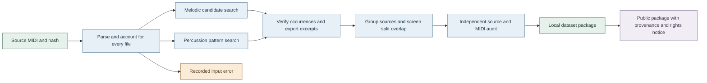

# Recurring phrase dataset research

This local pipeline extracts recurring melodic phrase candidates and separate percussion patterns from MIDI. It records the original source and all verified nonoverlapping occurrences, exports playable excerpts and provides an offline human review packet. A recurrence score is a structural ranking heuristic. It is not a validated measure of catchiness or involuntary musical imagery.

## Reproduce a run

The research package is separate from the historical GUI and its dependencies. Python 3.11 or newer is required. The recorded environment uses Python 3.12.

```sh
uv venv .venv --python 3.12
source .venv/bin/activate
uv pip install -r requirements-research.lock
pytest -q
python -m samuged.cli build --source 'datasets/Lakh MIDI Clean' --output research_local/my_reference_run --workers 4 --percussion --recover-invalid-keys
python -m samuged.audit --source 'datasets/Lakh MIDI Clean' --output research_local/my_reference_run --require-full
python scripts/validate_schema.py --dataset research_local/my_reference_run
python scripts/make_review.py --source 'datasets/Lakh MIDI Clean' --dataset research_local/my_reference_run --output research_local/my_reference_run/review.html --count 40
```

To run a deterministic pilot add `--limit 128` to the build command and use a separate output directory. The limit selects paths by a fixed hash, not alphabetical order. Do not describe a pilot as the entire source corpus.

A run can resume into its existing directory only with the same code and configuration fingerprint. New builds also bind the Python implementation, Python version and Mido version; changing those requires a new directory. Successful records and MIDI hashes are checked before reuse; failures are retried. Each completed file has an atomic record in `records/`. A build lock prevents simultaneous writes to one output directory. If a process was interrupted, inspect the PID in `.build.lock` and remove the lock only after confirming that process is no longer active. Changed code or parameters require a new output directory. The original source corpus is never changed.

Strict parsing is the default. The explicit `--recover-invalid-keys` option first tries the original parser. On an invalid key signature it validates the complete SMF structure and preserves that event's exact payload as ignored sequencer-specific metadata in memory. The receipt records every changed type byte, offsets and original/recovered SMF hashes. Source MIDI bytes are never rewritten. Other malformed inputs remain errors. See [input diagnostics](input_errors.md).

## What is saved

- `sources.jsonl` accounts for every discovered source in the selected cohort, including parse errors and no match outcomes.
- `phrases.jsonl` records each selected candidate, source hash and path, exact ticks, pitch and timing arrays, recurrence score components, occurrence coordinates and output MIDI hash.
- `midi/melodic/` and `midi/percussion/` contain separate excerpt collections.
- `build_config.json` and `provenance/` record parameters, source code, dependencies, interpreter and Git state.
- `summary.json` reports counts, limits and manifest hashes. `audit.json` checks artifact integrity and declared matching rules, binding its result to the exact manifests, build configuration and summary bytes. A run key identifies code and configuration, not a unique corpus. A matching run key alone is insufficient audit evidence.
- `review.html` provides a deterministic, blinded sample with actual source-derived occurrences and an optional rating export. Its basic synthesis is not the original song audio. Listener ratings are optional follow-up research and are not required to publish the algorithmic recurrence dataset.

Bulk source data and experiment output are ignored by Git. Small reports and aggregate measurements belong in `docs/research/`.

Some links in these notes point to ignored `research_local/` artifacts that exist only in a full local checkout. A public repository or release must publish the referenced artifact or replace the link with a public reference before relying on it as public evidence.



## Read the extracted collection

[The consumer guide](consumer_guide.md) gives the repository and wheel execution boundaries, archive verification and extraction sequence and manifest field semantics.

The complete archive includes MIDI payloads. Its sibling metadata directory contains the same manifests but does not copy the MIDI files. After extracting an archive, the following reads a melodic training candidate and its first two occurrence coordinates:

```python
import json
from pathlib import Path

release = Path("path/to/extracted/archive")
with (release / "phrases.jsonl").open() as stream:
    phrase = next(
        row for line in stream
        if (row := json.loads(line))["kind"] == "melodic"
        and row["split"] == "train"
    )
print(release / phrase["midi_path"])
print(phrase["occurrences"][:2])
```

Use `kind == "percussion"` for drum patterns. `views/melodic.unique.jsonl` and `views/percussion.unique.jsonl` provide one representative per canonical family. For the duplicate-screened analysis, join `views/duplicate_screening/phrase_splits.jsonl` by `phrase_id` and filter `screened_split` instead of the original `split`. A source file may have several candidates or none; `sources.jsonl` retains both no-match and error outcomes.

## Melodic method

Each MIDI track, channel and program combination is kept as a separate part. Channel 10 percussion is excluded from this branch. At each onset group within 1/24 quarter note, the highest note is selected. This deterministic skyline can represent the top of a chord rather than a true melody. Original notes remain in the source file, and removed-note fractions are reported.

Candidate windows contain 6, 8, 12, 16, 24 or 32 notes and span 4 to 32 quarter notes. This is a duration constraint, not a claim that every item is two to eight bars. Windows crossing a rest longer than two beats or containing fewer than three pitches are rejected. Pitch-interval seeds propose families. Complete windows are then checked against one fixed representative, avoiding transitive chains of weak matches.

Three modes provide ablations. `exact` uses absolute pitches and onset/duration tokens rounded to 1/24 beat. `transposed` removes a constant pitch shift. `approximate` also permits onset deviations up to 1/8 beat, pitch discrepancies in at most one eighth of notes and bounded duration differences. Approximate candidate generation includes disjoint four-note seeds and a pitch-only fallback. It does not yet align insertions and deletions. Limits and truncated candidate shortlists are recorded separately.

The optional `--algorithm aligned_indexed` branch compares windows of 6 through 32 notes with monotone note alignment. It permits bounded internal insertions, deletions and substitutions, a constant transposition and timing deviations. Terminal gaps and tempo warping are excluded. Every occurrence stores the matched note pairs and edit partition for independent verification against a fixed prototype. `--algorithm aligned` provides the unoptimized comparison implementation. The indexed version caches exact prototypes and seed calculations without changing the alignment rule. `--mode` applies only to the reference branch.

Alignment improves the frozen synthetic insertion/deletion cases, but regresses some adjacent exact repeats and is materially slower. The JKU external diagnostics are mixed. The reference branch therefore remains the default. Algorithm names, parameters and code snapshots must accompany any comparison; do not combine their outputs under an unstated common method.

The optional `--algorithm aligned_closed` uses indexed candidate generation and an exact-extension selection rule. A longer candidate can replace a nested sibling only with at least three complete exact occurrences, equal support, one-to-one endpoint containment and a recurrence score no more than 0.02 lower at that replacement step. The margin applies per step, so a chain can accumulate a larger total change. Replacements remain inside the same greedy shortlist and top-k policy. Saved `selection_trace` entries expose their families, counts, scores and intervals. Independent trace geometry checks accompany the ordinary source-note audit; `--reextract` also replays the full selection. See [the frozen study](closed_patterns.md) for measured improvements and limits.

The optional `--algorithm aligned_melody` reranks the complete indexed shortlist before applying the same closed selection rules. Its fixed part prior combines onset monophony (0.65) and voice independence (0.35), with adjustment strength 0.08. Track names and instrument labels are excluded from these features. The original recurrence scores remain unchanged, and `part_ranking` records the separate adjustment, selected candidates and replacements. Ordinary auditing checks source features and saved selected scores; full candidate order and replacement causality require `--reextract`. The [POP909 study and Lakh pilot](part_ranking.md) distinguish official part-role agreement from unmeasured perceptual quality.

Aligned algorithms accept `--seed-bucket-limit` from 1 through 2048, with default 192. A [development sensitivity study](seed_bucket_sensitivity.md) found that 768 reduced saturation in the selected limited cohort but changed one unlabelled real output. A larger search budget is not a guarantee of better phrase selection. Record the explicit setting and use a new output directory for comparisons.

Independent occurrence support uses maximum-cardinality interval selection. Reference ranking combines recurrence, covered duration, a preference around eight beats, pitch diversity, boundaries, match quality and a small disclosed instrument prior. Its penalty reduces repeated short arpeggios. Aligned ranking uses match quality (0.65), support (0.15), note length (0.12) and boundaries (0.08), without an instrument prior. The optional melody variant adds the separate structural part adjustment described above. These weights are engineering priors, not fitted listener preferences. Greedy overlap pruning selects at most three phrases per file. Overlapping and nested musical motifs can be valid; this compact dataset deliberately omits some of them.

## Percussion method

Drum parts are combined by exact onset and kit pitch. Simultaneous hits remain distinct. Duplicated strikes from different tracks are merged; each same-pitch gate is clipped at the next strike to avoid ambiguous crossed note-offs after track merging. Matching ignores gate length and velocity, while exports preserve strike onsets and velocities.

The detector searches one, two and four bar windows, with bar length computed as `ticks_per_beat * numerator * 4 / denominator`. Windows never cross a meter change. Tick zero and each meter change are assumed to start a bar; pickups and incorrect source meter labels are not inferred. At least eight strikes and two kit pitches are required. No pitch transposition is allowed. Timing tolerance is 1/12 beat and total missing or extra strikes are limited to ten percent of the larger pattern. Repetition of the same one-bar loop inside a longer window is penalized so it does not automatically outrank its primitive loop.

## Deduplication and splits

The local source inventory contains 17,232 MIDI paths and 17,232 distinct SHA256 values. Hidden artist directories are included. Byte uniqueness does not imply distinct compositions or arrangements.

Splits group artist keys, numbered title variants, byte duplicates and exact normalized arrangement fingerprints. Artist token order is normalized conservatively to join examples such as Michael Jackson and Jackson Michael. This is a grouping policy, not proof of identity. The arrangement fingerprint ignores global onset offset, uniform melodic transposition, velocity and track order, but is not a general cover-song detector. Soft duplicates and unknown artist aliases remain a limitation.

The split is deterministic for a fixed corpus manifest. Adding or removing connected group members can change its assignment, so preserve the released manifest instead of recomputing a split for an evolving corpus. Exact exported family fingerprints crossing splits are excluded from later splits under `overlap_excluded`. This only establishes separation for the recorded fingerprints, not all musically related phrases. No trained model or generalization result is claimed here.

The [supplementary duplicate screening view](duplicate_screening.md) quarantines whole groups connected by strong heuristic duplicate edges. It preserves the original manifests and joins by source or phrase ID. Use `screened_split` from this view when evaluating that sensitivity analysis, excluding both `overlap_excluded` and `duplicate_excluded`. The view changes the validation and test distributions. An independent verifier reconstructs all mappings and counts from the base manifests and recorded edges.

Local packaging creates separate melodic and percussion views, one representative per canonical family and a membership table. `phrase_count`, `source_count` and `split_group_count` describe recorded candidates, files and grouped sources. They are not counts of distinct compositions. Approximate families are centred on one prototype; two nonprototype members need not match each other directly.

## Evaluation and packaging

The local evaluation modules are `samuged.evaluate`, `samuged.evaluate_drums`, `samuged.drum_stress`, `samuged.evaluate_aligned`, `samuged.evaluate_jku`, `samuged.evaluate_themes` and `samuged.drum_oracle`. Each experiment has a distinct purpose. Synthetic planted motifs measure stated invariances, stress cases probe boundaries and external annotations check agreement with particular human pattern definitions. Their scores cannot be pooled as one corpus accuracy measure.

New studies should freeze the design, source hashes, case cohort, parameters and executable snapshot before detector execution. Keep the development and test distinction visible. Existing disclosed test results are not fresh data for parameter tuning. Record search and candidate-selection limits alongside every metric.

The initial `experiment_receipt.json` remains immutable. A separate `completion_receipt.json` binds the exact result set, normally `raw_results.json` and `aggregate.json`, to that initial receipt. `python scripts/verify_experiment.py --experiment PATH` checks saved source bytes and completed result hashes. A completion receipt establishes artifact integrity, not metric correctness. The paper validators recompute their reported metrics; `samuged.audit_themes` independently rebuilds external theme labels, statistics and detector predictions.

The snapshot builder follows static local Python imports recursively, including package initializers and conditional imports. Third-party versions and the dependency lock remain recorded separately. Computed dynamic imports must be declared explicitly by a study. Earlier experiments keep their original receipts; a later, more complete replication does not rewrite historical evidence.

After the full audit passes, a local metadata package can be created with:

```sh
python scripts/package_dataset.py --dataset research_local/my_reference_run --output research_local/my_local_package
```

Add `--screening PATH` for a validated supplementary split view. Add `--archive` to create a deterministic local archive including extracted MIDI. The package checks current manifest bindings and MIDI hashes again, provides `SHA256SUMS` and refuses to overwrite an existing output. An old audit without manifest/configuration bindings must be rerun. These commands create and verify package files; publication uses the resulting release artifacts.

Add `--selection-replay PATH` to include a completed [selection replay](selection_sample_audit.md), bound to the exact primary manifests and audit. The package distinguishes a bounded sample from explicit replay of every successfully parsed source. Parse errors remain outside that successful-source replay and stay visible in the primary artifact audit. The [paired ratings analyzer](paired_ratings_analysis.md) validates future listening exports while retaining missing responses as null; it does not create human labels.

Use `python scripts/verify_release.py --release PATH --archive ARCHIVE --output NEW_REPORT.json` to verify a metadata directory and its sibling archive without the original corpus. Omit `--archive` for metadata only. The [portable verifier](release_verification.md) checks exact file sets, hashes, manifest counts, audit bindings and included screening or replay evidence. It does not repeat extraction or authenticate the publisher.

The paper generator is `scripts/make_paper.py`. Its PDF input receipt records the exact dataset and evaluation artifacts used. Published claims must be limited to the measurements represented by those artifacts. The live [work log](WORK_LOG.md) distinguishes completed builds, experimental results and pending validation.

POP909, Theme Transformer and JKU are external evaluation inputs. They are not distributed with the public dataset. The publication includes their reported results and citations only; users must obtain the external inputs from their official sources.

## Evidence and remaining publication work

See [legacy audit](legacy_audit.md), [primary sources](sources.md) and [work log](WORK_LOG.md). Controlled planted motifs test known invariances and failure cases. They do not estimate precision or recall on real popular music. The unchanged legacy detector exports prototypes without occurrence coordinates, so its occurrence F1 is deliberately not reported.

For a public dataset release, inspect near duplicates and retain the redistribution rights notice. The repository code is MIT licensed. The [official Lakh page](https://colinraffel.com/projects/lmd/) labels the distributed collection CC BY 4.0 and requests citation of that page and [Raffel's 2016 thesis](https://colinraffel.com/publications/thesis.pdf). Attribution for the underlying compositions and arrangements is incomplete, so this project makes no independent clearance claim. Listener ratings and human phrase labels are optional follow-up research, not a publication gate for this algorithmic recurrence dataset. The release does not claim perceptual quality or validated earworm detection.

## Listening case study

The [Tool collection](tool_motifs.md) explores saved melodic and drum patterns from nine available MIDI songs. It is a personal listening case study with documented source limits.
