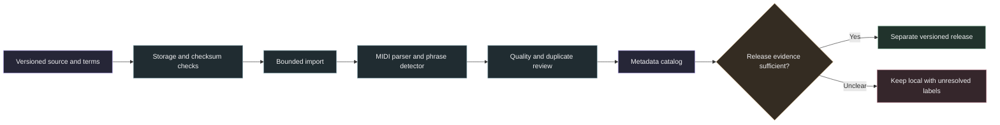

# Corpus expansion

The existing release remains unchanged. Expansion uses separate corpus builds and a SQLite catalog that joins their metadata. A corpus declaration is not a guarantee of rights to every composition. Labels record evidence, conditions and unknowns rather than a universal permission to reuse songs.



## Sources

The reviewed [source registry](sources.json) covers Lakh, PDMX, MAESTRO and DadaGP. It records primary evidence URLs and acquisition status. Versions marked `select_and_pin_before_import` are candidates, not imported data. DadaGP requires research access and terms from its authors. No request has been sent.

PDMX import must select `subset:no_license_conflict`. Its authors found contradictory licenses and recommend this subset. Keep per-score license declarations. Do not transfer a permissive declaration from one score to another.

MAESTRO uses CC BY-NC-SA 4.0. Keep it separate from Lakh when exporting adapted MIDI. Lakh's declared CC BY 4.0 is stored separately from the unresolved rights to underlying compositions.

## Catalog

The catalog is additive. It does not change existing JSONL or published Parquet schemas. It reads one source record at a time, preserves parse failures and rejects duplicate IDs within a build. Dataset identity and input hash namespace source and phrase keys across corpora. A metadata-only entry and an extracted pilot entry can refer to the same source in separate builds. Catalog record counts are not counts of unique songs.

| Table | Purpose |
| --- | --- |
| `datasets` | Source version, declared license, rights evidence and conditions |
| `builds` | Exact SHA-256 of each imported source-record file |
| `sources` | Original IDs, relative filenames, identity labels, hashes, parse and search quality, upstream metadata |
| `phrases` | Instrument family, pitch range, velocity mean, onset density, duration, repeats and matching flags |
| `annotations` | Categories such as genre or period, each with evidence URL and method |
| `phrase_catalog` | Joined view for filtering and sorting |

`unknown`, `declared`, `verified` and `restricted` describe evidence status. They are not permission flags. `verified` requires evidence. An absent genre, meter or tempo is not inferred from the song title. Filename identities remain `source_filename_unverified`. MIDI program families describe encoded instruments, not acoustic certainty. Percussion pitch bounds are kit note codes, not melodic registers.

Occurrence coordinates and edit summaries remain searchable. Detailed alignment pairs stay in the original results, linked by build hash, source ID and phrase ID. Duplicate hashes are indexed without collapsing different performances. Existing splits are retained as provenance; they are not a validated combined-corpus split.

Create a manifest with `schema_version: 1`, `datasets` from the registry and `builds` containing `dataset_id` and `records` (a JSONL path relative to the manifest). Optional `annotations` map original source IDs to arrays of `category`, `value`, `evidence_url` and `method`.

```sh
source .venv/bin/activate
python -m samuged.cli catalog --manifest manifest.json \
  --output research_local/catalog.sqlite --max-output-mb 256 --min-free-mb 2048
```

Example queries:

```sql
SELECT title, artist, instrument_family, occurrence_count, duration_beats
FROM phrase_catalog
WHERE kind = 'melodic' AND instrument_family = 'guitar'
ORDER BY occurrence_count DESC, recurrence_score DESC;

SELECT dataset_id, composition_rights, redistribution_status, COUNT(*)
FROM phrase_catalog
GROUP BY dataset_id, composition_rights, redistribution_status;
```

## Storage and file handling

Downloads require an explicit HTTPS URL, upstream checksum and byte budget. Redirects must remain HTTPS. Downloaded assets also receive a SHA-256 receipt. MD5, where supplied by a source, is an integrity check and not a security signature. Corpus downloads retain a disk reserve and never overwrite an existing file.

Archive extraction accepts regular `.mid`, `.midi`, `.json`, `.csv` and `.txt` files. It rejects symlinks, special entries, duplicate paths and traversal. File count and total extracted bytes are bounded before writing accepted entries. MIDI content is then validated by the existing bounded parser. Failed imports expose no partial corpus directory. Catalog JSONL records are limited to 16 MiB each. A SQLite page budget bounds the database. Temporary work also needs free space.

## Next research steps

1. Evaluate small source-stratified pilots with fixed algorithm settings. Record parser failures, search limits, duplicate arrangements and phrase coverage. Coverage is not musical correctness or earworm recognition.
2. Recover tempo and meter from source events, retain official identities and guitar articulation evidence. Do not silently reinterpret malformed source metadata.
3. Compare timing normalization, ornament handling and polyphonic boundaries against the current algorithm on frozen controls and real annotated passages. Do not loosen matching without measuring false matches.
4. Support Guitar Pro or MusicXML through an adapter that retains original files, conversion versions, strings, frets, tuning and effects. These adapters are not implemented by the catalog.
5. Build cross-corpus duplicate groups and evaluation splits before combining corpora for training. Publish new data only with source-specific conditions and reproducible receipts.

## Reproduce the first expansion pilot

Use a fresh directory on a volume with at least 10 GiB of spare storage. The acquisition command previews assets unless `--download` is supplied. It downloads about 475 MiB of archives and metadata, not audio or PDFs. Prepared corpora and indexes need additional space.

```sh
source .venv/bin/activate
python -m scripts.acquire_corpus_assets --root research_local/expansion --download
python -m scripts.prepare_corpus_pilots --root research_local/expansion
python -m samuged.cli build --source research_local/expansion/pdmx_pilot \
  --output research_local/expansion/pdmx_closed --algorithm aligned_closed \
  --workers 2 --percussion --recover-invalid-keys
python -m samuged.cli build --source research_local/expansion/maestro_pilot \
  --output research_local/expansion/maestro_closed --algorithm aligned_closed \
  --workers 2 --percussion --recover-invalid-keys
python -m scripts.enrich_corpus_pilot_metadata --root research_local/expansion
python -m samuged.audit --source research_local/expansion/pdmx_pilot \
  --output research_local/expansion/pdmx_closed --require-full --reextract
```

The selected score metadata, checksums and exact sample policy are saved locally. Source event enrichment retains tempo changes, meters, MIDI resolution and source instruments. MAESTRO composer metadata stays separate from performer identity. Original extraction files remain unchanged.

The first pilot covers 16 PDMX scores and the eight shortest MAESTRO performances. It is a smoke test, not a representative benchmark. PDMX metadata screening also retains 189,704 valid conflict-free Public Domain or CC0 declarations. These metadata-only rows contain no extracted phrases. All 24 pilot sources parsed; 53 melodic phrases were exported and verified with full replay. Two MAESTRO sources hit search limits. The existing filename-based split grouping is not suitable for these corpora, because paths group PDMX under `mid` and MAESTRO under years. No combined training split or accuracy claim is made.

Full PDMX extraction, a full MAESTRO run, Guitar Pro ingestion, new matching ablations and an expanded public release remain separate next stages. Do not describe the metadata screening as a completed phrase dataset.

The expanded PDMX pilot uses 1,000 scores selected by the same fixed policy. It extracted 2,372 melodic phrases from 921 sources. All 1,000 sources parsed. Three sources reached search limits and 68 carried parser warnings. Extraction took about 103 seconds with two workers and occupied about 37 MiB. The pilot excludes longer and denser scores, so this timing is not a full corpus forecast. Independent replay and artifact checking passed for all 1,000 sources and all 2,372 exports. Listener ratings are not available.

A full screened PDMX extraction can run in resumable batches:

```bash
source .venv/bin/activate
python -m scripts.run_corpus_batches --root research_local/expansion \
  --batch-size 250 --workers 2 --reserve-gib 10
```

Each batch preserves source paths, exported MIDI, extraction receipts and independent full replay checks. Storage checks retain a 10 GiB reserve between batches. The default run extracts melodic phrases. `--percussion` adds the separate drum detector. Batch split labels are bookkeeping only. They must not be used for model evaluation or published as a combined training split. Global duplicate grouping, official identity joins and release review follow extraction. This command does not publish data.
