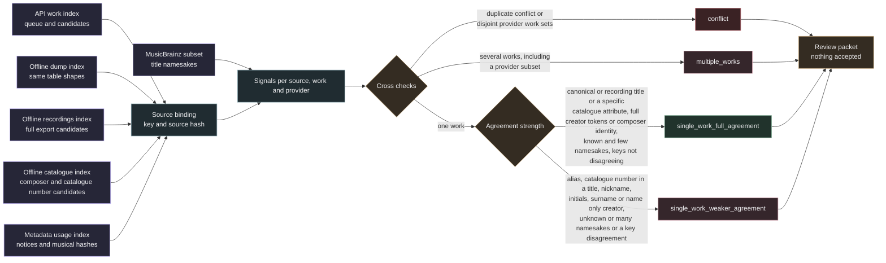

# Candidate assessment

This layer sorts unreviewed work candidates into review tiers and records the cross checks behind each tier. It reads the API work index, the optional offline dump index, the optional offline recordings index, the optional offline catalogue index, the metadata usage index and the optional MusicBrainz subset. All inputs are attached read only and hashed before and after the run. The result is a separate SQLite file with assessments and signals. It is not a review and it is not a rights clearance.



## Inputs and binding

Up to four candidate indexes are read. They share the `queue` and `work_candidates` columns the assessment uses.

| Input | Origin | Provider | Evidence policy |
| --- | --- | --- | --- |
| `--work-index` | `work_index` | `musicbrainz` | `work-candidates-v3` and older API policies |
| `--offline-index` | `offline_index` | `musicbrainz_json_dump` | `work-candidates-v3-dump` |
| `--recordings-index` | `recordings_index` | `musicbrainz_fullexport` | `work-candidates-v3-fullexport` |
| `--catalogue-index` | `catalogue_index` | `musicbrainz_fullexport_catalogue` | `work-candidates-v5-catalogue` |

The recordings index is the sidecar written by [offline recording candidates from the full export](work_identity_offline_recordings.md). Its candidates come from the recording rule, so their evidence has the API recording shape. The title agreement is `recording_title_normalized`, the creator agreement is the full credit agreement (`normalized_tokens` or the weaker `initials_candidate`) and `work.relations` lists the agreeing writers. Its `recording_namesake_count` counts recordings, not works, so it is not used as `namesake_count`. Like API rows, full export rows take their namesake count from `--subset`.

The catalogue index is the sidecar written by `work_identity_offline_catalogue` from the same full export. Its composer resolves to one artist, either through the creator identities of the offline works index (`composer_identity`) or by a person name with a single namesake (`composer_name_single_namesake`). Its candidates are the works of that composer whose own title or alias carries the catalogue number (MusicBrainz keeps catalogue numbers in work titles, the attribute path exists for completeness), reduced to the highest matched ancestor and without arrangements of another matched work. The `match_basis` holds the `title_agreement` (`catalogue_number_attribute`, `catalogue_number_title` or the quoted `nickname_quoted`), the `catalogue_key` and whether it is specific (a bare opus such as `op27` is not) `key_agreement`, which compares the work key attribute with the key named in the title, and `form_agreement`, which compares the form words of the title (sonata, etude, nocturne and so on) with those of the work, its aliases and its parts. `title_namesake_count` counts the parent works of the composer that matched the key, so these rows carry their own namesake count and do not need `--subset`. Its `related_work_ids` list the movements, parts and arrangements that were reduced into the candidate. A candidate of another provider that appears in that list counts as the catalogue work: the sets compared by the provider cross check and the distinct work counts use the catalogue work in its place, the row keeps its own work id, records it as `canonical_work` and gets the reason "candidate is a part or version of another candidate work and counts as that work". A dump candidate for the first movement of a sonata therefore agrees with the catalogue candidate for the sonata instead of conflicting with it. The work relations list the composer. The rule never compares the music.

MusicBrainz lists many classical works more than once, one entry per editor, so a source whose composer and catalogue number resolve cleanly would still count several works. Catalogue candidates of one source form a duplicate family when they share the composer and a specific catalogue key (`op25no10`, `bwv807`), or a bare key such as `op36` together with an equal normalized title. Nickname matches never form a family. The family counts as its lowest work id: the other members, the parts they list and the rows of other providers for any member record that id as `canonical_work`, every row records the members as `work_family` and the rule as `work_family_rule`, the distinct work counts use one work and no row of the source reaches the full tier. The reason reads "2 duplicate works of one composer and catalogue number count as the lowest work id" (with "and title" for the bare key rule). Two numbered pieces of the same opus have different titles and stay separate works.

Every candidate source key must exist in its own queue, in the API work index queue and in `metadata.records`, all with the same `source_sha256`. Each provider may come from one origin only. A provider that appears in two indexes, a candidate whose evidence claims a verified source identity or a binding mismatch stops the run with an error and no output.

Several recording rows for the same work collapse into one assessment row per source, work and provider. Older evidence policies without a `match_basis` are kept and assessed with unknown agreement.

## Signals

| Signal | Meaning |
| --- | --- |
| `distinct_works` | Distinct work candidates for this source from this provider |
| `distinct_works_all_providers` | Distinct work candidates for this source from all providers |
| `title_agreement` | Strongest title agreement recorded in the evidence, ranked as canonical, recording, catalogue number attribute, alias, catalogue number title and quoted nickname |
| `creator_agreement_kind` | Strongest creator agreement recorded in the evidence, ranked as `normalized_tokens`, `composer_identity`, `initials_candidate`, `composer_name_single_namesake`, `surname_subset` or none; for work lookups the best writer agreement |
| `writers` | Composer, writer, lyricist and librettist names from the work relations |
| `namesake_count` | Works whose canonical title equals the normalized query title: `title_namesake_count` from the dump evidence, otherwise the subset `work_count` for API rows. Catalogue rows carry their own count |
| `title_alias_namesake_count` | Works that match the title only through an alias, from the dump evidence or the subset `alias_count`; recorded, not used for the tier |
| `notice_check` | MIDI copyright notice compared with writer names, see below |
| `duplicate_check` | Candidates of other sources with the same musical hash, see below |
| `provider_cross_check` | Work sets of all providers for this source, see below |
| `providers` | Providers that proposed this work for this source |
| `key_agreement` | `agrees`, `disagrees` or `unknown` from the catalogue evidence, comparing the work key attribute with the key named in the title; `disagrees` keeps a row out of the full tier |
| `catalogue_key` | The catalogue key that matched, for example `op27no2` or `bwv846`, or the quoted nickname |
| `catalogue_key_specific` | `false` for a bare opus such as `op27` and for a quoted nickname, `true` otherwise |
| `form_agreement` | `agrees`, `disagrees` or `unknown` from the catalogue evidence; none for other providers |
| `canonical_work` | The work this candidate counts as: the catalogue work that lists it among its related parts or versions, or the lowest work id of its duplicate family, else none |
| `work_family`, `work_family_rule` | Sorted work ids of the duplicate family this row counts in and the rule that formed it (`catalogue_key` or `catalogue_key_and_title`), else none |

API and full export rows have no work namesake count of their own. Without `--subset` their count is unknown and they can reach at most `single_work_weaker_agreement`, so pass `--subset` when these rows should be able to reach the full tier. Catalogue rows carry their own count and do not need it.

Each row also stores the evidence policy, the index it came from, recording ids, the work title, the candidate group and the counts behind every check.

### Copyright notice check

| Value | Rule |
| --- | --- |
| `no_notice` | The source has no notice text |
| `corroborates` | A writer surname token of at least four letters, or the full normalized writer name, appears in a notice |
| `names_other_party` | No writer matches and the notice contains a capitalized word of at least four letters that is not a notice or company form word |
| `uninformative` | The notice contains only years, notice words and similar text |

MIDI notices usually name the sequencer or the publisher, not the songwriter, so they cannot contradict a writer. `names_other_party` is kept as a signal and a reason string that prompts a reviewer to read the notice. It never sets the `conflict` tier.

### Duplicate check

Other sources with the same `musical_sha256` are compared when they have candidates in either index. `duplicates_agree` means every such duplicate also has this work. `duplicates_conflict` means some duplicate has only works outside this source's candidate set. `duplicates_partial` covers overlapping sets that lack this particular work. `no_duplicates` means no musical duplicate has candidates; `duplicate_count` still reports all duplicates.

### Provider cross check

| Value | Rule |
| --- | --- |
| `single_provider` | Only one provider has candidates for the source |
| `providers_agree` | All providers found the same work set |
| `providers_overlap` | No two work sets are disjoint but not all are equal; `provider_sets_nested` is true when every pair of sets is nested |
| `providers_differ` | At least one pair of work sets is disjoint |

The work sets are compared per source, one set per provider that has candidates. With more than two providers a single disjoint pair is enough for `providers_differ`, for example an API set and a full export set that share no work while the dump set contains both. The catalogue provider follows the same rule, so a catalogue set that is disjoint from another provider's set is a conflict.

The dump provider checks every namesake and adds the librettist role and sort name agreement, so a dump superset of the API work set is expected rather than a contradiction. Overlap is not a conflict; the extra works lead to `multiple_works`. Only disjoint work sets set the `conflict` tier.

## Tiers

The first matching tier applies.

| Tier | Rule | Base |
| --- | --- | --- |
| `conflict` | `duplicates_conflict` or `providers_differ` (disjoint work sets) | 0 |
| `multiple_works` | More than one distinct work from this provider or from all providers | 3 |
| `single_work_full_agreement` | One work, canonical or recording title or a specific catalogue number (attribute or title), creator by full tokens or composer identity, `namesake_count` known and at most three, with no key or form disagreement and no duplicate family | 1 |
| `single_work_weaker_agreement` | One work otherwise: alias title, quoted nickname, bare opus number, initials, surname only or name only creator, missing match basis, unknown `namesake_count`, one above three, a key disagreement, a form disagreement or a duplicate family | 2 |

A bare opus number stays at the weaker tier because one opus number can cover several works. A catalogue number read from the work title counts as a full title agreement when it is specific, since MusicBrainz records catalogue numbers in titles.

`source_summary` holds one row per source. The best tier is `conflict` when any row is a conflict, otherwise the most favourable tier among the rows. It also records the providers, the number of distinct works, short human readable reasons and the review priority. Lower priority values are reviewed first.

The review priority is `base * 2 - 1` when a copyright notice corroborates a writer and `base * 2` otherwise, so corroborated sources sort first within their tier. Conflicts always have priority 0.

| Best tier | Notice corroborates | Otherwise |
| --- | --- | --- |
| `conflict` | 0 | 0 |
| `single_work_full_agreement` | 1 | 2 |
| `single_work_weaker_agreement` | 3 | 4 |
| `multiple_works` | 5 | 6 |

## What it never establishes

Every summary row carries `identity_status` `unverified_assessment_only` and `rights_clearance` `not_established`. The module never writes to `reviews` or `rights_observations`, never modifies an input index and never uses the network. A full agreement tier says that labels and database relations agree. It does not compare the music, and a reviewer still has to accept or reject the identity through the work identity review.

## Storage and outputs

Assess the live API work index only while its lookup chain is paused. `prepare` holds the work index lock file (`work_index.with_suffix('.lock')`, the same file the lookup runner locks) for the whole build. A runner started meanwhile fails fast, and `prepare` refuses with `work index lock held` while a runner is active.

The output is built at a temporary path in the target directory, checked with `PRAGMA integrity_check` and then linked into place, so an existing file is never replaced. The page budget allows about 1 GiB. The run refuses to start when less than 10.75 GiB is free. Input hashes are recorded in `provenance` and checked again before commit.

| Table | Content |
| --- | --- |
| `provenance` | Policy `candidate-assessment-v3`, input paths and hashes, creation time |
| `assessments` | One row per source, work and provider with tier and signals |
| `source_summary` | Best tier, distinct works, providers, priority and reasons per source |

## Commands

```sh
source .venv/bin/activate
python -m samuged.candidate_assessment prepare \
  --work-index /path/to/work_identity_v04.sqlite \
  --metadata /path/to/metadata_usage_v07.sqlite \
  --offline-index /path/to/work_identity_offline.sqlite \
  --recordings-index /path/to/work_identity_offline_recordings_v01.sqlite \
  --catalogue-index /path/to/work_identity_offline_catalogue_v01.sqlite \
  --subset /path/to/musicbrainz_subset_v01.sqlite \
  --output /path/to/candidate_assessment_v02.sqlite

python -m samuged.candidate_assessment summary \
  --assessment /path/to/candidate_assessment_v02.sqlite

python -m samuged.candidate_assessment packet \
  --assessment /path/to/candidate_assessment_v02.sqlite \
  --work-index /path/to/work_identity_v04.sqlite \
  --recordings-index /path/to/work_identity_offline_recordings_v01.sqlite \
  --catalogue-index /path/to/work_identity_offline_catalogue_v01.sqlite \
  --output /path/to/review_packet.json --tier conflict --limit 200
```

`--offline-index`, `--recordings-index` and `--catalogue-index` are optional and independent. `summary` counts best tiers per dataset, the notice, duplicate and provider check values and the assessments per provider. `packet` writes a JSON file for up to 1000 sources ordered by review priority and source key. It lists the source labels and each candidate with its work title, writers, provider, tier, signals and MusicBrainz work URL. The packet refuses an existing output and refuses any index passed to it (`--work-index`, `--offline-index`, `--recordings-index` or `--catalogue-index`) that is missing from the assessment provenance or whose hash differs from it. It hashes the assessment and the indexes again before writing and refuses when any of them changed. Its header states that nothing in it is an accepted identity.
