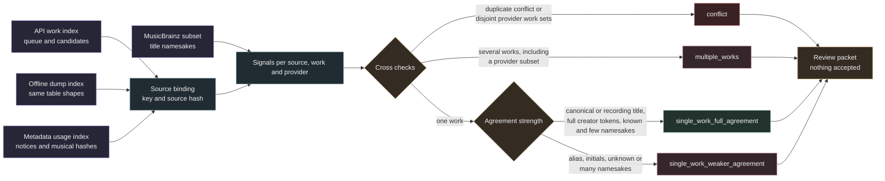

# Candidate assessment

This layer sorts unreviewed work candidates into review tiers and records the cross checks behind each tier. It reads the API work index, the optional offline dump index, the metadata usage index and the optional MusicBrainz subset. All inputs are attached read only and hashed before and after the run. The result is a separate SQLite file with assessments and signals. It is not a review and it is not a rights clearance.



## Inputs and binding

Both candidate indexes have the same `queue` and `work_candidates` tables. The offline index is a second source of candidate rows; its provider is `musicbrainz_json_dump` and its evidence policy is `work-candidates-v3-dump`. Every candidate source key must exist in its own queue, in the API work index queue and in `metadata.records`, all with the same `source_sha256`. A provider that appears in both indexes, a candidate whose evidence claims a verified source identity or a binding mismatch stops the run with an error and no output.

Several recording rows for the same work collapse into one assessment row per source, work and provider. Older evidence policies without a `match_basis` are kept and assessed with unknown agreement.

## Signals

| Signal | Meaning |
| --- | --- |
| `distinct_works` | Distinct work candidates for this source from this provider |
| `distinct_works_all_providers` | Distinct work candidates for this source from all providers |
| `title_agreement` | Strongest title agreement recorded in the evidence: canonical, recording or alias |
| `creator_agreement_kind` | `normalized_tokens`, `initials_candidate` or none; for work lookups the best writer agreement |
| `writers` | Composer, writer, lyricist and librettist names from the work relations |
| `namesake_count` | Works whose canonical title equals the normalized query title: `title_namesake_count` from the dump evidence, or the subset `work_count` for API rows |
| `title_alias_namesake_count` | Works that match the title only through an alias, from the dump evidence or the subset `alias_count`; recorded, not used for the tier |

API rows have no namesake count of their own. Without `--subset` their count is unknown and they can reach at most `single_work_weaker_agreement`, so pass `--subset` when API rows should be able to reach the full tier.
| `notice_check` | MIDI copyright notice compared with writer names, see below |
| `duplicate_check` | Candidates of other sources with the same musical hash, see below |
| `provider_cross_check` | Work sets of the API and dump providers for this source, see below |

Each row also stores the evidence policy, the index it came from, recording ids, the work title, the candidate group and the counts behind every check.

### Copyright notice check

| Value | Rule |
| --- | --- |
| `no_notice` | The source has no notice text |
| `corroborates` | A writer surname token of at least four letters, or the full normalized writer name, appears in a notice |
| `names_other_party` | No writer matches and the notice contains a capitalized word of at least four letters that is not a notice or company form word |
| `uninformative` | The notice contains only years, notice words and similar text |

MIDI notices usually name the sequencer or the publisher, not the songwriter, so they cannot contradict a writer. `names_other_party` is kept as a signal and a reason string that prompts a reviewer to read the notice. It never sets the `conflict` tier.

### Duplicate check

Other sources with the same `musical_sha256` are compared when they have candidates in either index. `duplicates_agree` means every such duplicate also has this work. `duplicates_conflict` means some duplicate has only works outside this source's candidate set. `duplicates_partial` covers overlapping sets that lack this particular work. `no_duplicates` means no musical duplicate has candidates; `duplicate_count` still reports all duplicates.

### Provider cross check

| Value | Rule |
| --- | --- |
| `single_provider` | Only one provider has candidates for the source |
| `providers_agree` | Both providers found the same work set |
| `providers_overlap` | The work sets share works but differ; `provider_sets_nested` is true when one set is a strict subset of the other |
| `providers_differ` | The work sets are disjoint |

The dump provider checks every namesake and adds the librettist role and sort name agreement, so a dump superset of the API work set is expected rather than a contradiction. Overlap is not a conflict; the extra works lead to `multiple_works`. Only disjoint work sets set the `conflict` tier.

## Tiers

The first matching tier applies.

| Tier | Rule | Base |
| --- | --- | --- |
| `conflict` | `duplicates_conflict` or `providers_differ` (disjoint work sets) | 0 |
| `multiple_works` | More than one distinct work from this provider or from all providers | 3 |
| `single_work_full_agreement` | One work, canonical or recording title, creator by full tokens, `namesake_count` known and at most three | 1 |
| `single_work_weaker_agreement` | One work otherwise: alias title, initials, missing match basis, unknown `namesake_count` or one above three | 2 |

`source_summary` holds one row per source. The best tier is `conflict` when any row is a conflict, otherwise the most favourable tier among the rows. It also records the providers, the number of distinct works, short human readable reasons and the review priority. Lower priority values are reviewed first.

The review priority is `base * 2 - 1` when a copyright notice corroborates a writer and `base * 2` otherwise, so corroborated sources sort first within their tier. Conflicts always have priority 0.

| Best tier | Notice corroborates | Otherwise |
| --- | --- | --- |
| `conflict` | 0 | 0 |
| `single_work_full_agreement` | 1 | 2 |
| `single_work_weaker_agreement` | 3 | 4 |
| `multiple_works` | 5 | 6 |

## What it never establishes

Every summary row carries `identity_status` `unverified_assessment_only` and `rights_clearance` `not_established`. The module never writes to `reviews` or `rights_observations`, never modifies an input index and never uses the network. A full agreement tier says that labels and database relations agree. It does not compare the music, and a reviewer still has to accept or reject the identity through the work identity review.

## Storage and outputs

Assess the live API work index only while its lookup chain is paused. `prepare` holds the work index lock file (`work_index.with_suffix('.lock')`, the same file the lookup runner locks) for the whole build. A runner started meanwhile fails fast, and `prepare` refuses with `work index lock held` while a runner is active.

The output is built at a temporary path in the target directory, checked with `PRAGMA integrity_check` and then linked into place, so an existing file is never replaced. The page budget allows about 1 GiB. The run refuses to start when less than 10.75 GiB is free. Input hashes are recorded in `provenance` and checked again before commit.

| Table | Content |
| --- | --- |
| `provenance` | Policy `candidate-assessment-v1`, input paths and hashes, creation time |
| `assessments` | One row per source, work and provider with tier and signals |
| `source_summary` | Best tier, distinct works, providers, priority and reasons per source |

## Commands

```sh
source .venv/bin/activate
python -m samuged.candidate_assessment prepare \
  --work-index /path/to/work_identity_v04.sqlite \
  --metadata /path/to/metadata_usage_v07.sqlite \
  --offline-index /path/to/work_identity_offline.sqlite \
  --subset /path/to/musicbrainz_subset_v01.sqlite \
  --output /path/to/candidate_assessment_v01.sqlite

python -m samuged.candidate_assessment summary \
  --assessment /path/to/candidate_assessment_v01.sqlite

python -m samuged.candidate_assessment packet \
  --assessment /path/to/candidate_assessment_v01.sqlite \
  --work-index /path/to/work_identity_v04.sqlite \
  --output /path/to/review_packet.json --tier conflict --limit 200
```

`summary` counts best tiers per dataset and the notice, duplicate and provider check values. `packet` writes a JSON file for up to 1000 sources ordered by review priority and source key. It lists the source labels and each candidate with its work title, writers, provider, tier, signals and MusicBrainz work URL. The packet refuses an existing output and refuses indexes whose hashes differ from the assessment provenance. It hashes the assessment and the indexes again before writing and refuses when any of them changed. Its header states that nothing in it is an accepted identity.
