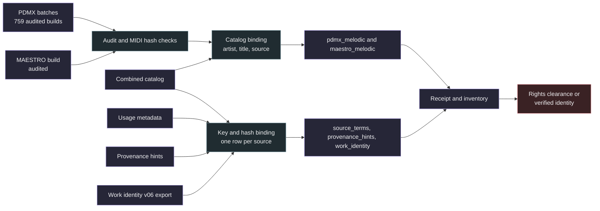

# Expansion publication

This builder turns the audited PDMX and MAESTRO extractions and the per source metadata layers into Parquet files that mirror the public dataset layout. It reads every input read only and performs no upload. See [publication](../../publication/README.md) for the upload step.



## Phrase configurations

`pdmx_melodic` and `maestro_melodic` use the phrase schema in `samuged/publication_schema.py`, the same schema the Lakh builder writes. PDMX batches are selected through `corpus_release.audited_batches`, which requires a finished extraction, passing audits, unchanged manifests and one detector configuration. The MAESTRO build gets the same audit and hash checks.

Each phrase is bound to the catalog. The builder recomputes the catalog key `digest((build_id, source_id))`, which is stable and indexed, and checks that the catalog source has the same source id, source path and source hash, and that the catalog has the phrase row with the same kind. `source_sha256` alone is not a join key, because 29,818 PDMX hashes occur under more than one source. `artist` and `title` come from the catalog, which holds upstream score metadata for PDMX and performance metadata for MAESTRO. `split` is `unassigned` and `split_group` is the catalog split group or the source key. MIDI bytes are read from the audited build and hashed against `midi_sha256`.

## Metadata configurations

Each metadata row carries `source_key`, `source_id`, `source_sha256` and `dataset_id`, checked against the catalog. Input records must have exactly the expected keys. Text fields stay strings, counts are integers and lists or objects are JSON text with a `_json` suffix.

| Configuration | Source | Columns after the join columns |
| --- | --- | --- |
| `source_terms` | `usage_metadata.jsonl.gz` | 33 text fields, `warning_count`, `search_limited`, `notice_truncated`, then `corpus_conditions_json`, `copyright_notices_json`, `external_metadata_candidates_json`, `usage_conditions_json`, `usage_evidence_json` |
| `provenance_hints` | `provenance_hints_v01.jsonl.gz` | `claim_class`, `search_route`, `identity_status`, `rights_clearance`, `policy`, `reasons_json`, `hints_json` |
| `work_identity` | [merge export](work_identity_merge.md) | `title`, `creator`, `query_kind`, `api_status`, `dump_works_status`, `dump_recordings_status`, `dump_recordings_reason`, `dump_catalogue_status`, `dump_catalogue_reason`, `best_tier`, `identity_status`, `rights_clearance`, `policy`, `candidate_count`, `review_priority`, `candidates_json`, `assessment_reasons_json` |

Every configuration must cover every catalog source once, and the three key sets must be identical. The work identity export must match its receipt hash and must have been built from the given assessment.

## Outputs

| Path | Content |
| --- | --- |
| `data/<config>/part-NNNNN.parquet` | Rows sharded by `--rows-per-file` (50,000 by default), zstd compressed |
| `evidence/expansion_build_receipt.json` | Input paths and hashes, PDMX batch audit digest, rows and files per configuration, licenses, `identity_verified: false`, `rights_clearance: not_established` |
| `evidence/expansion_inventory.json` | Bytes and SHA-256 of every produced file |

The inventory has its own name so it does not replace the published `publication_inventory.json`. The folder is built under a temporary name and renamed when complete, and an existing output is never replaced.

| Configuration | License recorded in the receipt |
| --- | --- |
| `pdmx_melodic` | CC BY 4.0 corpus license, per score Public Domain Mark or CC0 declarations kept in `source_terms` |
| `maestro_melodic` | CC BY NC SA 4.0, noncommercial and share alike |
| `source_terms`, `provenance_hints`, `work_identity` | CC BY 4.0, MusicBrainz fields CC0 1.0 |

## Verification

`verify` checks every inventory hash, the file list and schema of each configuration and its row count against the receipt. It hashes `midi_bytes` against `midi_sha256` on a deterministic, evenly spaced sample of 1,000 rows per phrase configuration (every row when fewer). It reads every `source_key` of the metadata configurations, checks uniqueness and identical key sets, and checks that every phrase `source_id` appears in `source_terms`.

```sh
python -m samuged.expansion_publication prepare --output NEW_EXPANSION_DIR \
  --pdmx-root pdmx_full --maestro-dataset maestro_full_closed \
  --catalog snapshot/combined_catalog.sqlite --usage snapshot/usage_metadata.jsonl.gz \
  --hints provenance_hints_v01.jsonl.gz --identity work_identity_v06.jsonl.gz \
  --assessment candidate_assessment_v02.sqlite --registry docs/research/corpus/sources.json
python -m samuged.expansion_publication verify --output NEW_EXPANSION_DIR
```

Labels in these files are evidence, not clearance. Candidates are unverified, and no field establishes composition, arrangement or performance rights.
