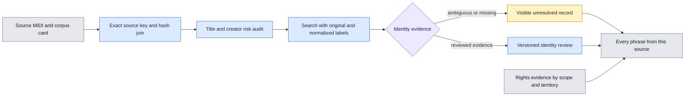

# Track identity quality

Each source has its own evidence record. Original metadata, source paths and rights declarations remain available. Search hints and database candidates need review before they establish the musical work.



## What the audit checks

| Signal | Interpretation |
| --- | --- |
| Missing creator | The source does not provide a usable creator hint |
| Initials | More than one person can share the same shortened name |
| Unverified artist or byte duplicate hint | The creator role or work identity needs evidence |
| Title shared by different creator labels | A title alone cannot select the work |
| Normalization collision | Different original title or creator strings produced the same query |
| Generic title | Labels such as Untitled and Song offer little identity evidence |
| Duplicate metadata conflict | Equal MIDI bytes have conflicting creator claims |
| Copyright scan unavailable | The MIDI notice could not be read, rather than being absent |
| Extraction warnings | Musical extraction warnings or search limits need inspection |

Counts measure source records carrying each signal. They overlap. Different arrangements, legitimate aliases and variations in spelling can produce these signals. They are not measured false matches or verified copyright conflicts. A record without a risk flag still needs identity evidence.

The filename remains a source locator and search hint. It never becomes a composer, rights holder or verified work identifier. Source IDs and hashes bind each record to its original inputs. Musical comparison is explicitly `not_performed` in this audit.

## Search and inheritance

The work index can include `source_identity_quality`. Text search then includes normalized labels and original source paths. A risk filter helps prepare a review queue:

```sh
source .venv/bin/activate
python -m samuged.work_identity search \
  --index /path/to/work_identity.sqlite \
  --risk identity_title_multiple_creators --limit 50
```

`search_candidates` and `phrase_evidence` include the same source quality record. Identity reviews and rights observations remain append only. They are read separately, so a later reviewed decision is not confused with the baseline audit state.

Build a new derived index from an audited work index, the original metadata and the bound catalog:

```sh
python -m samuged.identity_quality \
  --work-index /path/to/audited_work_index.sqlite \
  --metadata /path/to/metadata_usage.sqlite \
  --catalog /path/to/combined_catalog.sqlite \
  --output /path/to/quality_work_index.sqlite
```

The Python `export` function produces bounded gzip JSONL containing every source audit, identity risks, work candidates, reviews and rights observations. Keep the linked source usage and copyright exports with it. This output is a local review artifact until applicable redistribution conditions are established.

The builder checks source coverage and hashes in both directions, validates SQLite integrity and foreign keys, preserves its inputs and refuses an existing output. Storage limits retain a 10 GiB reserve. The export checks source coverage, index stability and its size budget. External requests retain the MusicBrainz rate limit and bounded pilot budgets.

## Limits

Many scores lack useful creator information. Their identities and composition rights cannot be filled reliably from a filename or title alone. MusicBrainz supplies candidate identity evidence. The MLC requires authorized access for ownership information. Neither a database identifier nor a corpus license declaration establishes every intended use. Keep missing, ambiguous and unchecked evidence explicit.

## MIDI notice recovery

The notice scanner has an explicit `allow_clipped_data` option. It retries only when MIDI note or controller data bytes violate the 0 to 127 range. This reads copyright metadata while preserving the original file bytes. It does not rerun musical extraction or establish the scope of the notice. Key signature recovery retains its strict structural checks. Unsupported combined errors and truncated metadata remain unavailable.

`import_notice_recovery` appends a recovery receipt to the work index and retains the previous quality record. It validates source hashes, input bindings, notice limits and the metadata read scope. Successful recovery updates the per source notice status and removes the unavailable scan flag. Duplicate imports and active lookup locks are rejected. Failed attempts remain recorded. Identity decisions and rights observations stay separate. The original source rights index remains an immutable baseline, while work search, phrase evidence and the portable quality export include the recovered notices.
