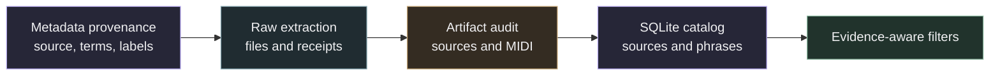
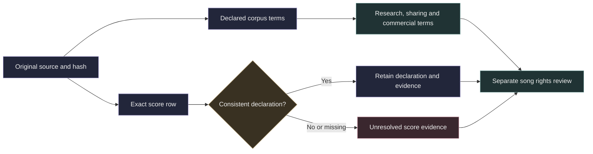

# Corpus metadata and release preparation

The release preparation layer keeps source metadata, raw extraction files and the searchable index connected by provenance. Extraction output remains a separate, versioned artifact. SQLite is a derived index for looking up sources and extracted phrases. Each catalog build records the hash of its input records so the index can be traced back to the extraction data used to create it.



## Preserve provenance and uncertainty

The `datasets` table records corpus-level declarations such as `dataset_license`, `composition_rights`, `redistribution_status`, conditions and evidence. A corpus license declaration does not establish rights in every composition. A score's own license declaration must stay attached to that score and remain distinct from both the corpus declaration and composition rights. The current catalog keeps upstream source metadata in `sources.metadata_json` and exposes corpus-level rights in `phrase_catalog`; it does not have a dedicated score-license column.

Values such as `unknown`, `declared`, `verified` and `restricted` describe the available rights evidence. They are not permissions. Preserve unknown and absent values without turning them into a positive rights claim. Metadata labels are evidence records, not permissions. A metadata label or license declaration alone does not establish that a composition can be redistributed or reused.

Keep upstream metadata and annotations with their evidence URL and method. For genre, group and tag fields, retain the source's original values. Do not replace them with an invented genre taxonomy. If derived labels are introduced later, keep them distinct from the original values and record how they were derived.

Artist and title values parsed from filenames or supplied as upstream labels do not establish a verified source identity. When the upstream label is the only identity evidence, preserve the identity as unverified. File hashes can identify matching files; they do not by themselves verify artist, title or composition identity.

## Metadata rows and extracted phrases

A source metadata row can exist without any extracted phrase. The `sources` table holds source records and extraction status; `phrases` holds detected phrase records. The `phrase_catalog` view joins phrase rows to their source and dataset, so a metadata-only source is not a phrase in that view. Keep metadata-only records distinct from extracted phrases when counting sources, phrases or progress.

The catalog exposes these useful filters:

- Artist and title, from the source fields.
- Corpus, through `dataset_id`.
- Genre or another category, by matching `annotations.category` and `annotations.value` and retaining the annotation's evidence URL and method.
- Phrase kind (`melodic` or `percussion`) and encoded instrument family.
- Duration in beats, occurrence count, pitch bounds, mean velocity and onset density.
- Parse warnings and repairs, search-limited status and curation-truncated status.
- Corpus-level `composition_rights` and `redistribution_status`, plus the declared corpus license.

Instrument families are derived from MIDI program numbers; they describe the encoded program and do not establish the acoustic identity of an instrument. For percussion, pitch bounds are kit note codes rather than melodic register. Onset density is the number of distinct phrase onsets divided by duration in beats. These values support search and review; they are not quality or identity judgments.

## Parameterized SQLite examples

Bind every value through SQLite parameters, for example with `connection.execute(sql, params)`. Do not build SQL by interpolating labels or other input strings. The examples use exact matches so the bound values are compared as data.

Find phrases for a source in one corpus and a category label that has an evidence record:

```sql
SELECT DISTINCT p.phrase_key, p.kind, p.instrument_family,
       a.category, a.value, a.evidence_url, a.method
FROM phrase_catalog AS p
JOIN annotations AS a ON a.source_key = p.source_key
WHERE p.dataset_id = :dataset_id
  AND p.artist = :artist
  AND p.title = :title
  AND a.category = :category
  AND a.value = :value
  AND a.evidence_url <> ''
ORDER BY p.phrase_key;
```

Find melodic guitar phrases within musical measurement bounds:

```sql
SELECT phrase_key, artist, title, duration_beats, occurrence_count,
       pitch_min, pitch_max, velocity_mean, onset_density
FROM phrase_catalog
WHERE kind = :kind
  AND instrument_family = :instrument_family
  AND duration_beats BETWEEN :min_duration AND :max_duration
  AND occurrence_count >= :min_occurrences
  AND pitch_min <= :highest_pitch
  AND pitch_max >= :lowest_pitch
  AND velocity_mean BETWEEN :min_velocity AND :max_velocity
  AND onset_density BETWEEN :min_density AND :max_density
ORDER BY occurrence_count DESC, duration_beats;
```

Find phrases by corpus-level rights evidence and extraction warnings or search limits:

```sql
SELECT phrase_key, dataset_id, dataset_license,
       composition_rights, redistribution_status,
       warning_count, repair_count, search_limited, curation_truncated
FROM phrase_catalog
WHERE composition_rights = :composition_rights
  AND redistribution_status = :redistribution_status
  AND warning_count >= :min_warnings
  AND search_limited = :search_limited
ORDER BY dataset_id, warning_count DESC;
```

The rights fields in `phrase_catalog` describe the corpus declaration. Per-score declarations remain source-level evidence and are not filtered by these corpus-level columns.

## Current run status

The completed local expansion covers 189,704 PDMX source records and 1,276 MAESTRO performances. Combined with the existing Lakh build, the catalog contains 208,212 source records and 558,159 phrases. These are not counts of unique compositions. PDMX contains three recorded source errors and 242 sources with search limits. MAESTRO has no source errors and 655 sources with search limits. Technical replay checks do not establish listener accuracy or exhaustive phrase coverage. The expansion is local and has not been published.

Batch-local split labels are bookkeeping and are not valid model evaluation splits. A valid evaluation needs split groups that account for source identity and cross-corpus duplicates, rather than batch assignment.

## Prepare an audited local snapshot

```sh
source .venv/bin/activate
python -m scripts.prepare_corpus_release --root research_local/expansion \
  --output research_local/expansion/snapshot
python -m samuged.cli catalog \
  --manifest research_local/expansion/snapshot/catalog_manifest.json \
  --output research_local/expansion/snapshot/catalog.sqlite \
  --max-output-mb 2048 --min-free-mb 10240
```

Preparation requires a completed extraction unless `--allow-partial` is supplied. Partial snapshots are explicitly marked incomplete. It verifies audit hashes, source hashes and MIDI hashes, joins the screened metadata and copies MIDI by hard link. Use a new output directory on the same filesystem. The snapshot retains source tempo and meter events and encoded instrument parts. Detailed note alignment pairs remain in the original audited batches, referenced by their hashes.

Source annotations include `composer`, `genre_raw`, `group_raw`, `tag_raw`, `license_declaration` and `duplicate_group`. Every label has an evidence URL and method. A duplicate group combines matching bytes or matching normalized arrangement fingerprints. It is a candidate group, not a verified song identity. Sources are retained rather than removed. Artist and song keys inferred from folders are stored only as extraction provenance. Snapshot split labels are `unassigned` until a global split policy is reviewed. This command does not publish data.

## Filter without writing SQL

Inspect the available categories and original genre values:

```sh
python -m samuged.cli catalog-info --catalog snapshot/catalog.sqlite
python -m samuged.cli catalog-info --catalog snapshot/catalog.sqlite --category genre_raw
```

Find 50 recurring classical phrases and export their metadata:

```sh
python -m samuged.cli catalog-search --catalog snapshot/catalog.sqlite \
  --category genre_raw --value classical --kind melodic \
  --min-repeats 3 --sort repeats --limit 50 --output classical.json
```

Use `--text` for literal title or artist text. Add `--dataset`, `--instrument`, `--min-beats`, `--max-beats`, `--rights` or `--redistribution` to narrow the result. `--no-warnings` excludes sources with recorded warnings or repairs. `--no-search-limit` filters the catalog's recorded source search limit flag. Neither flag establishes perceptual quality or an exhaustive search. Sort by `repeats`, `duration`, `density`, `score` or `title`.

Category values are exact source labels. `classical-folk` is distinct from `classical`. Run `catalog-info --category composer` to inspect composer labels. Missing labels stay missing. Rights filters match evidence status, not reuse permission. Dataset conditions and evidence are shown by `catalog-info`. Tempo and meter timelines include MIDI defaults when explicit events are absent.

Search is read-only, uses bound parameters and returns at most 500 rows. Queries have a 10 second time budget. `--offset` supports bounded pagination. The default output is JSON. Use `--format csv --output results.csv` for a spreadsheet export. Existing files are not replaced. CSV escapes formula-like labels, including leading whitespace, while JSON retains the original text.

## Review coverage and duplicate candidates

```sh
python -m samuged.cli catalog-review --catalog snapshot/combined_catalog.sqlite \
  --sample-limit 20 --output review.json
```

This read only report counts source statuses, missing identity and fingerprint fields, warnings, repairs, search limits and annotation coverage per corpus. It also records phrase duration and recurrence ranges, corpus conditions and the catalog hash. Missing artist fields do not mean missing composers, composer annotations are counted separately. Source counts describe build specific records, so importing several versions of one corpus does not create several new songs.

Two separate checks group equal file hashes and equal normalized arrangement hashes. They count cross corpus groups and candidates that occur in more than one recorded evaluation split. Counts from the two checks overlap and must not be added. Examples are limited to 100 groups per method and eight members per group. Unknown hashes are excluded from grouping and counted as missing.

Arrangement equality is a candidate signal. It does not establish verified song identity and this report does not perform approximate similarity matching. Zero recorded split conflicts is insufficient to validate an evaluation split, particularly while sources remain `unassigned`. Use these findings to review global grouping before assigning evaluation splits. The command changes no splits, removes no sources and publishes nothing.


## Indexed source metadata

Build a separate index without changing extraction receipts or the original catalog:

```sh
python -m samuged.catalog_metadata prepare --catalog snapshot/combined_catalog.sqlite \
  --output snapshot/metadata_search.sqlite
python -m samuged.catalog_metadata search --metadata snapshot/metadata_search.sqlite \
  --text "Nirvana" --dataset lakh --limit 50
python -m samuged.catalog_metadata search --metadata snapshot/metadata_search.sqlite \
  --composer "Johann Sebastian Bach" --output bach.json
python -m samuged.catalog_metadata search --metadata snapshot/metadata_search.sqlite \
  --dataset pdmx --score-license publicdomain
```

FTS5 indexes title, artist, composer and the original genre text. Underscores are treated as spaces in search text while the original labels remain unchanged. Text tokens are combined with AND. Filters use bound parameters. Queries are read only, time bounded and return at most 500 records. Source results include records without extracted phrases, use the phrase catalog to find playable exports.

The index separates corpus license, score license declaration, score license URL, composition rights evidence and redistribution evidence. It preserves attribution conditions and source URLs. `publicdomain` is an upstream declaration, not an independent legal assessment. The Public Domain Mark is not the same as a CC0 dedication. MAESTRO remains under its separate noncommercial and share alike conditions. The combined index has no single license that overrides the source conditions.

Global candidate groups use the transitive union of equal complete file hashes and equal normalized arrangement hashes across all corpora. Empty fingerprints and empty arrangements do not create links. Groups do not establish composition identity, approximate similarity or ownership. Evaluation splits remain unassigned because differently arranged versions of the same work can evade exact grouping. No rows are removed.

## External text metadata

MusicBrainz core metadata is CC0. Supplementary tags, ratings and other metadata have separate terms. The bounded adapter in `samuged.metadata_links` requests only recording IDs, titles and artist credits. It uses an identifying user agent, waits between requests, bounds response sizes and stops on service failures. It does not download a database archive, lyrics or cover art.

Normalized title and artist agreement produces candidate links only. Several recordings may match one MIDI label. Links retain their provider, entity ID, URL, method, retrieval date and metadata license. Import is transactional and cannot replace source artist, title or rights fields. Candidate links are not used to merge groups or assign evaluation splits. Prefer verified upstream IDs where available before widening this process.

The local pilot queried 20 Lakh records and retained 68 recording candidates with no service failures. This is a small interoperability check, not complete external metadata coverage. Source metadata and external metadata remain distinct tables.

## Storage retention

Retain original acquisitions, extraction manifests, audit receipts, exported MIDI and referenced alignment records. Derived SQLite indexes and superseded search previews can be regenerated from hashed manifests. Before removing an index, verify its successor and record its path, size and hash in a local cleanup receipt. Do not remove the original MIDI corpus or raw extraction records merely because a search index exists.

## Song rights and MIDI copyright evidence

The source rights scan adds a separate table to a new copy of the metadata index. It reads original MIDI files, verifies their source hashes and extracts copyright meta events only. It does not collect lyrics. The original extraction and metadata index remain unchanged.

| Field | Meaning |
| --- | --- |
| `dataset_license` | Corpus declaration, not clearance for every composition |
| `score_license_declaration` and `score_license_url` | Original per score declaration and its URL |
| `musical_work_license` | Independently supported composition license, null when unknown |
| `musical_work_license_status` | Evidence status, currently unknown |
| `musical_work_rights_holder` and `musical_work_evidence_url` | Supported holder and evidence, null when unknown |
| `copyright_notices` | Original MIDI copyright text, track and tick |
| `copyright_notice_status` | present_unverified, absent or unavailable |
| `copyright_notice_scope` | Notice scope has not been established |
| `scan_status` | scanned, scanned_metadata_repaired, size_limit, hash_mismatch or read_or_parse_error |
| `notice_truncated` | Text or event limit was reached |

A missing notice does not mean no copyright. A file copyright notice does not establish the composer, rights holder or music license. An upstream Public Domain Mark is a declaration, not a CC0 dedication. Composition rights stay unknown until supported by evidence that applies to the identified work and relevant jurisdiction. Do not infer rights from the artist name, a MusicBrainz candidate or the corpus license.

See the [Lakh attribution notes](https://colinraffel.com/projects/lmd/), [Public Domain Mark](https://creativecommons.org/publicdomain/mark/1.0/) and [CC0](https://creativecommons.org/publicdomain/zero/1.0/) for the source statements.

Create a JSON file mapping dataset IDs to the local original corpus roots, then run:

```sh
python -m samuged.source_rights --metadata snapshot/metadata_search.sqlite \
  --catalog snapshot/combined_catalog.sqlite --output snapshot/metadata_rights.sqlite \
  --roots roots.json --progress rights_scan_status.json --workers 4
python -m samuged.catalog_metadata search --metadata snapshot/metadata_rights.sqlite \
  --copyright-status present_unverified --copyright-text "Copyright" --limit 50
python -m samuged.catalog_metadata search --metadata snapshot/metadata_rights.sqlite \
  --work-license-status unknown --dataset lakh --output rights_review.json
python -m samuged.source_rights --export-index snapshot/metadata_rights.sqlite \
  --output rights_metadata.jsonl.gz
```

Each source gets a rights row even if its original file cannot be parsed. The scan bounds file size, collected text and workers. Failed, oversized or changed files stay visible in the report. Notices are bound to the exact original file hash. The source table and rights table must have identical coverage before the new index is promoted. Search results also expose external metadata candidate links with their evidence and license.

The scanner supports valid RIFF RMID containers. Invalid key signature metadata can be recovered with the same bounded helper as the MIDI parser. This is recorded as `scanned_metadata_repaired`. Original file hashes and copyright event text remain unchanged. Text is decoded using Mido's default Latin1 charset, its apparent author or owner is not inferred.

The completed local scan accounts for all 208,212 sources. Copyright events are present in 1,861 Lakh files. Twenty eight files required key signature metadata recovery and 237 remain unavailable for parsing. A portable gzip JSONL export of every source keeps corpus terms, per score declarations, notices, unknown work rights and external candidate evidence together.

## Usage terms for each source

The usage index answers two different questions. What do the declared source terms permit? Have all rights for this particular song and file been established? It stores the answers separately. It never treats a title match, absent copyright notice or corpus license as full song clearance.

| Field | Meaning |
| --- | --- |
| `research_terms_status` | Declared terms for noncommercial research |
| `redistribution_terms_status` | Declared terms for sharing files and adaptations for noncommercial use |
| `commercial_terms_status` | Declared terms for commercial use |
| `overall_clearance_status` | All relevant rights established or not established |
| `score_review_status` | Consistency of upstream score declarations and selection flags |
| `source_score_id` and `score_metadata_path` | Source score identifier and archived metadata reference |
| `usage_evidence` | Source URLs, license URL, policy version and exact score row with CSV hash |
| `usage_conditions` | Conditions and unresolved rights scopes |

`conditional_declared` means the source terms permit the use if their conditions apply and are met. `restricted_declared` means those terms restrict that use. `unresolved` means the required terms or score evidence are missing or conflicting. These are evidence labels, not legal permission verdicts. Commercial use remains restricted under MAESTRO's CC BY NC SA terms. A Public Domain Mark is an identification claim, not a copyright license or a CC0 dedication. Jurisdiction and rights in the arrangement or performance still matter.

PDMX score rows join on the full original MIDI archive path. Titles, basenames and `best_path` are not join keys. The annotation checks the license and URL against the catalog and requires `license_conflict=False`, `subset:no_license_conflict=True` and `subset:all_valid=True`. Missing evidence and contradictions remain visible. A score ID is extracted from the upstream metadata path. It does not imply that its live score page was checked or that the uploader owned every relevant right. No holder is guessed from an artist, composer or publisher label.



```bash
python -m samuged.source_usage --metadata snapshot/metadata_rights.sqlite \
  --catalog snapshot/combined_catalog.sqlite --pdmx-csv pdmx.csv \
  --output snapshot/metadata_usage.sqlite
python -m samuged.catalog_metadata search --metadata snapshot/metadata_usage.sqlite \
  --dataset pdmx --score-review declaration_consistent --limit 50
python -m samuged.catalog_metadata search --metadata snapshot/metadata_usage.sqlite \
  --commercial-terms restricted_declared --limit 50
python -m samuged.source_rights --export-index snapshot/metadata_usage.sqlite \
  --output usage_metadata.jsonl.gz
```

The output is a new local index and preserves the source catalog. Its receipt binds the catalog, prior metadata and PDMX CSV hashes. Every source must have one usage row. Search and the portable export include the usage evidence. This process does not publish files, assign evaluation splits or resolve a recording candidate into a verified composition.

Primary evidence comes from [Lakh](https://colinraffel.com/projects/lmd/), [PDMX](https://github.com/pnlong/PDMX), [MAESTRO](https://magenta.tensorflow.org/datasets/maestro) and the [CC BY](https://creativecommons.org/licenses/by/4.0/), [CC BY NC SA](https://creativecommons.org/licenses/by-nc-sa/4.0/) and [Public Domain Mark](https://creativecommons.org/publicdomain/mark/1.0/) terms. A full clearance claim needs evidence for the identified work, arrangement and performance in the intended use and jurisdiction. MusicBrainz core metadata can help identify candidates but its metadata license does not license the music.

There is no universal lookup that establishes all permissions for a MIDI file. The [ISWC registry](https://www.iswc.org/iswc) identifies a musical work but does not supply ownership shares, which can vary by territory and right. Its automated lookup service has separate [access and use terms](https://www.iswc.org/sites/iswc/files/files/2024-08/ISWC%20ALS%20Terms%20and%20Conditions.pdf). No registry access contract or permission to publish ownership data is assumed. The local source evidence is ready for a later review against identified works and applicable permissions. This review is unfinished and no record is labeled as fully cleared.
