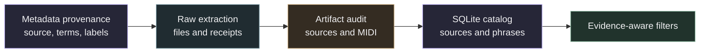

# Corpus metadata and release preparation

The release preparation layer keeps source metadata, raw extraction files and the searchable index connected by provenance. Extraction output remains a separate, versioned artifact. SQLite is a derived index for looking up sources and extracted phrases. Each catalog build records the hash of its input records so the index can be traced back to the extraction data used to create it.



## Preserve provenance and uncertainty

The `datasets` table records corpus-level declarations such as `dataset_license`, `composition_rights`, `redistribution_status`, conditions and evidence. A corpus license declaration does not establish rights in every composition. A score's own license declaration must stay attached to that score and remain distinct from both the corpus declaration and composition rights. The current catalog keeps upstream source metadata in `sources.metadata_json` and exposes corpus-level rights in `phrase_catalog`; it does not have a dedicated score-license column.

Values such as `unknown`, `declared`, `verified` and `restricted` describe the available rights evidence. They are not permissions. Preserve unknown and absent values without turning them into a positive rights claim. Metadata labels are evidence records, not permissions. A metadata label or license declaration alone does not establish that a composition can be redistributed or reused.

Keep upstream metadata and annotations with their evidence URL and method. For genre, group and tag fields, retain the source's original values. Do not replace them with an invented genre taxonomy. If derived labels are introduced later, keep them distinct from the original values and record how they were derived.

Artist and title values parsed from filenames or supplied as upstream labels do not establish a verified source identity. When the upstream label is the only identity evidence, preserve the identity as unverified. File hashes can identify matching files; they do not by themselves verify artist, title or composition identity.

## Metadata rows and extracted phrases

A source metadata row can exist without any extracted phrase. The `sources` table holds source records and extraction status; `phrases` holds detected phrase records. The `phrase_catalog` view joins phrase rows to their source and dataset, so a metadata-only source is not a phrase in that view. Keep metadata-only records distinct from extracted phrases when counting sources, phrases or progress.

The catalog exposes these useful filters:

- Artist and title, from the source fields.
- Corpus, through `dataset_id`.
- Genre or another category, by matching `annotations.category` and `annotations.value` and retaining the annotation's evidence URL and method.
- Phrase kind (`melodic` or `percussion`) and encoded instrument family.
- Duration in beats, occurrence count, pitch bounds, mean velocity and onset density.
- Parse warnings and repairs, search-limited status and curation-truncated status.
- Corpus-level `composition_rights` and `redistribution_status`, plus the declared corpus license.

Instrument families are derived from MIDI program numbers; they describe the encoded program and do not establish the acoustic identity of an instrument. For percussion, pitch bounds are kit note codes rather than melodic register. Onset density is the number of distinct phrase onsets divided by duration in beats. These values support search and review; they are not quality or identity judgments.

## Parameterized SQLite examples

Bind every value through SQLite parameters, for example with `connection.execute(sql, params)`. Do not build SQL by interpolating labels or other input strings. The examples use exact matches so the bound values are compared as data.

Find phrases for a source in one corpus and a category label that has an evidence record:

```sql
SELECT DISTINCT p.phrase_key, p.kind, p.instrument_family,
       a.category, a.value, a.evidence_url, a.method
FROM phrase_catalog AS p
JOIN annotations AS a ON a.source_key = p.source_key
WHERE p.dataset_id = :dataset_id
  AND p.artist = :artist
  AND p.title = :title
  AND a.category = :category
  AND a.value = :value
  AND a.evidence_url <> ''
ORDER BY p.phrase_key;
```

Find melodic guitar phrases within musical measurement bounds:

```sql
SELECT phrase_key, artist, title, duration_beats, occurrence_count,
       pitch_min, pitch_max, velocity_mean, onset_density
FROM phrase_catalog
WHERE kind = :kind
  AND instrument_family = :instrument_family
  AND duration_beats BETWEEN :min_duration AND :max_duration
  AND occurrence_count >= :min_occurrences
  AND pitch_min <= :highest_pitch
  AND pitch_max >= :lowest_pitch
  AND velocity_mean BETWEEN :min_velocity AND :max_velocity
  AND onset_density BETWEEN :min_density AND :max_density
ORDER BY occurrence_count DESC, duration_beats;
```

Find phrases by corpus-level rights evidence and extraction warnings or search limits:

```sql
SELECT phrase_key, dataset_id, dataset_license,
       composition_rights, redistribution_status,
       warning_count, repair_count, search_limited, curation_truncated
FROM phrase_catalog
WHERE composition_rights = :composition_rights
  AND redistribution_status = :redistribution_status
  AND warning_count >= :min_warnings
  AND search_limited = :search_limited
ORDER BY dataset_id, warning_count DESC;
```

The rights fields in `phrase_catalog` describe the corpus declaration. Per-score declarations remain source-level evidence and are not filtered by these corpus-level columns.

## Current run status

The current full PDMX run covers 189,704 screened metadata rows and is unfinished. That number is a count of screened metadata rows, not a count of extracted phrases. This run has not produced a publication or a perceptual accuracy claim. These metadata and catalog records do not promise rights clearance or future delivery.

Batch-local split labels are bookkeeping and are not valid model evaluation splits. A valid evaluation needs split groups that account for source identity and cross-corpus duplicates, rather than batch assignment.

## Prepare an audited local snapshot

```sh
source .venv/bin/activate
python -m scripts.prepare_corpus_release --root research_local/expansion \
  --output research_local/expansion/snapshot
python -m samuged.cli catalog \
  --manifest research_local/expansion/snapshot/catalog_manifest.json \
  --output research_local/expansion/snapshot/catalog.sqlite \
  --max-output-mb 2048 --min-free-mb 10240
```

Preparation requires a completed extraction unless `--allow-partial` is supplied. Partial snapshots are explicitly marked incomplete. It verifies audit hashes, source hashes and MIDI hashes, joins the screened metadata and copies MIDI by hard link. Use a new output directory on the same filesystem. The snapshot retains source tempo and meter events and encoded instrument parts. Detailed note alignment pairs remain in the original audited batches, referenced by their hashes.

Source annotations include `composer`, `genre_raw`, `group_raw`, `tag_raw`, `license_declaration` and `duplicate_group`. Every label has an evidence URL and method. A duplicate group combines matching bytes or matching normalized arrangement fingerprints. It is a candidate group, not a verified song identity. Sources are retained rather than removed. Artist and song keys inferred from folders are stored only as extraction provenance. Snapshot split labels are `unassigned` until a global split policy is reviewed. This command does not publish data.

## Filter without writing SQL

Inspect the available categories and original genre values:

```sh
python -m samuged.cli catalog-info --catalog snapshot/catalog.sqlite
python -m samuged.cli catalog-info --catalog snapshot/catalog.sqlite --category genre_raw
```

Find 50 recurring classical phrases and export their metadata:

```sh
python -m samuged.cli catalog-search --catalog snapshot/catalog.sqlite \
  --category genre_raw --value classical --kind melodic \
  --min-repeats 3 --sort repeats --limit 50 --output classical.json
```

Use `--text` for literal title or artist text. Add `--dataset`, `--instrument`, `--min-beats`, `--max-beats`, `--rights` or `--redistribution` to narrow the result. `--no-warnings` excludes sources with recorded warnings or repairs. `--no-search-limit` filters the catalog's recorded source search limit flag. Neither flag establishes perceptual quality or an exhaustive search. Sort by `repeats`, `duration`, `density`, `score` or `title`.

Category values are exact source labels. `classical-folk` is distinct from `classical`. Run `catalog-info --category composer` to inspect composer labels. Missing labels stay missing. Rights filters match evidence status, not reuse permission. Dataset conditions and evidence are shown by `catalog-info`. Tempo and meter timelines include MIDI defaults when explicit events are absent.

Search is read-only, uses bound parameters and returns at most 500 rows. Queries have a 10 second time budget. `--offset` supports bounded pagination. The default output is JSON. Use `--format csv --output results.csv` for a spreadsheet export. Existing files are not replaced. CSV escapes formula-like labels, including leading whitespace, while JSON retains the original text.
