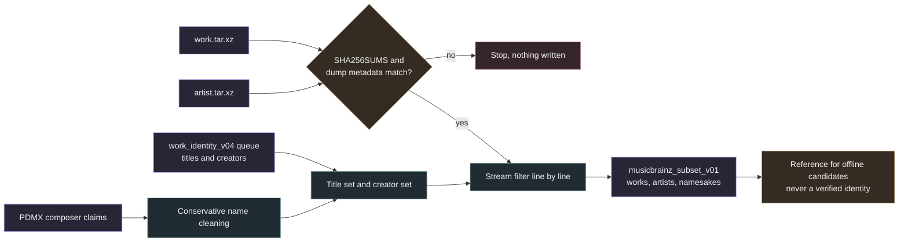

# MusicBrainz dump subset

The subset is a small local SQLite file built from the MusicBrainz JSON dumps. It keeps work and artist records whose normalized titles or creator names occur in the work identity queue, together with namesake counts across the whole dump. Offline work candidate matching and composer life spans read this subset instead of calling the MusicBrainz API.

The subset is reference data. A row in it is not a match for any source, and nothing in it establishes a source identity or permission to use the music. Every provenance row records `identity_verified` false and `rights_clearance` `not_established`.



## Inputs

The dump directory holds `work.tar.xz`, `artist.tar.xz`, `SHA256SUMS` and optionally `SHA256SUMS.asc`. Each archive contains `TIMESTAMP`, `COPYING`, `README`, `REPLICATION_SEQUENCE`, `SCHEMA_SEQUENCE` and one newline delimited JSON member, `mbdump/work` or `mbdump/artist`. The dump data is published under [CC0](https://musicbrainz.org/doc/About/Data_License) and the subset records `CC0-1.0` with that URL.

The title set holds the normalized title of every queue row in the immutable `work_identity_v04.sqlite`, across all datasets. The creator set holds an order insensitive name key for every queue creator and for cleaned PDMX composer claims from `pdmx_score_metadata_v01.sqlite`. The name key sorts the normalized tokens, so `Goldsmith, Jerry` and `Jerry Goldsmith` share one key, and accents and apostrophes are folded. Keys with fewer than three letters and digits, such as `m` or `j s`, are dropped because they would match too many unrelated artists. Single words of three or more characters, such as `Seal` or `Queen`, stay. The provenance records the number of dropped keys in `creator_keys_dropped_short`.

`creator_search_names` cleans a raw composer claim conservatively. It removes life dates in parentheses or at the end of the value, takes the name after `Urheber:` in German archive fields and drops unattributed or unknown markers (`unbekannt`, `unknown`, `anon`, `trad` and their variants), lone question marks, URLs and anything the label audit does not classify as a named claim. Each name is capped at 120 characters. Values that cannot be cleaned are dropped rather than guessed.

## Verification

1. The full archive SHA-256 is computed in 1 MiB chunks and compared with its `SHA256SUMS` entry before any tar member is read. A missing entry or a mismatch stops the run and writes nothing.
2. When `gpg` is on the path, `gpg --verify SHA256SUMS.asc SHA256SUMS` runs with a 30 second timeout and without key retrieval. The result is recorded as `verified`, `unverified_key_missing_or_failed`, `gpg_unavailable` or `signature_missing`. The run never fails because of the signature, and `verified` does not check the trust level of the key.
3. `TIMESTAMP`, `REPLICATION_SEQUENCE` and `SCHEMA_SEQUENCE` must appear before the dump member. The artist pass must come from the same dump directory with the same replication and schema sequence as the works pass. Each archive has its own `TIMESTAMP`, so the timestamp is recorded per pass but not compared.
4. Input files are hashed before and after the works pass. The subset is hashed before and after the artist pass. Any change stops the run.
5. Archives are streamed with `tarfile` in stream mode and never extracted to disk. Dump lines are parsed with `json` only. A single line above 16 MiB in the work dump or above 64 MiB in the artist dump stops the run. The longest lines in the 2026-10-03 dump are 1.6 MiB for works and 48.7 MiB for artists, with four artist lines above 16 MiB. Unexpected member names are ignored and never used as paths.

Outputs are bounded to about 2 GiB through `PRAGMA max_page_count`, built in a temporary file in the output directory and moved into place only after an integrity check. `prepare` refuses an existing output. Both passes require 10.75 GiB of free storage before they start.

## Filtering and counts

The works pass keeps a work when its normalized title or any normalized alias is in the title set. For every title in the set it records `work_count` (works whose canonical title has that label) and `alias_count` (works where only an alias has it), counted across the entire dump rather than only the kept works.

The artist pass keeps an artist when its MBID appears in a creator relation of a kept work (composer, writer, lyricist, librettist, arranger, orchestrator, translator, instrument arranger or vocal arranger) or when its name, sort name or alias key is in the creator set. For every creator key it records `person_count` and `total_count` from names and sort names across the entire dump and `alias_count` for artists matched only through an alias.

`--limit-lines N` stops after N dump lines for smoke runs. The provenance then records `truncated` true, and all namesake counts are partial.

## Stored fields and exclusions

| Table | Content |
| --- | --- |
| `provenance` | One row per pass with policy `musicbrainz-dump-subset-v1`, dump name, archive hash, size, signature status, lines read, records kept, truncation, timestamp, sequences, input hashes, set sizes, dropped short creator keys and license |
| `title_set`, `creator_set` | The normalized titles and creator keys the subset was filtered against |
| `works`, `work_titles` | Kept works and their canonical and alias title labels |
| `title_namesakes` | Whole dump namesake counts for every title in the set |
| `artists`, `artist_names` | Kept artists with life span columns and their name, sort name and alias keys |
| `name_namesakes` | Whole dump namesake counts for every creator key |

Work records keep the MBID, title, type, languages, ISWCs, disambiguation, aliases, creator relations with artist MBIDs, work relations, URL relations, the number of recording relations and up to three recording titles. Artist records keep the MBID, names, type, gender, country, disambiguation, life span, aliases, ISNI and IPI codes and URL relations. Tags, genres, ratings, annotations, type IDs and areas are excluded. All MBIDs are validated as UUIDs before they are stored, and an invalid one stops the run.

## What the subset never establishes

A shared title or name key is a lookup key, not evidence that a source is a given work or that a creator is a given artist. Namesake counts describe ambiguity, and a count of one does not prove uniqueness beyond the dump. Life spans are inputs to term estimates, not rights decisions. Popularity, relation counts and recording counts are never used to resolve an ambiguous name.

## Local use

```sh
source .venv/bin/activate
python -m samuged.musicbrainz_dump prepare \
  --dumps /path/to/musicbrainz_json_dumps/20261003-001001 \
  --work-index /path/to/work_identity_v04.sqlite \
  --score-metadata /path/to/pdmx_score_metadata_v01.sqlite \
  --output /path/to/musicbrainz_subset_v01.sqlite
python -m samuged.musicbrainz_dump add-artists \
  --dumps /path/to/musicbrainz_json_dumps/20261003-001001 \
  --subset /path/to/musicbrainz_subset_v01.sqlite
python -m samuged.musicbrainz_dump status --subset /path/to/musicbrainz_subset_v01.sqlite
```

The artist pass runs separately, so it can start once the artist archive has finished downloading. It refuses a subset that already has artists. Progress is printed to standard error every 200 000 lines. Results are printed as JSON. No command uses the network.
