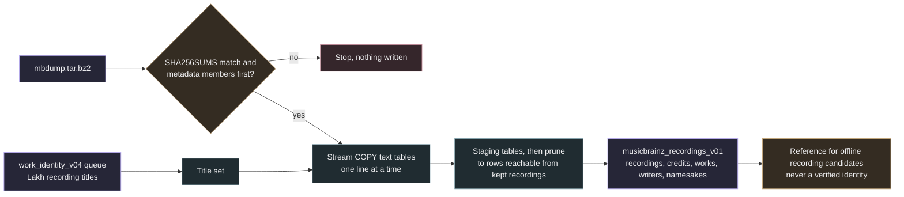

# MusicBrainz full export recording subset

`samuged/musicbrainz_fullexport.py` builds a small local SQLite file from the MusicBrainz Postgres full export (`mbdump.tar.bz2`). It keeps the recordings whose normalized titles occur among the Lakh recording rows of the work identity queue, their artist credits, their work relations, the creator relations of those works and whole database recording namesake counts. [Offline recording candidates](work_identity_offline_recordings.md) read this subset instead of calling the MusicBrainz API once per second.

The subset is reference data. A recording in it is not a match for any source, and nothing in it establishes a source identity or permission to use the music. The provenance row records `identity_verified` 0 and `rights_clearance` `not_established`, both enforced by `CHECK` constraints.



## Inputs

The export directory holds `mbdump.tar.bz2`, `SHA256SUMS` and optionally `SHA256SUMS.asc`. The archive contains `TIMESTAMP`, `COPYING`, `README`, `REPLICATION_SEQUENCE` and `SCHEMA_SEQUENCE` at the root and one `mbdump/<table>` member per Postgres table in COPY text format (tab separated columns, `\N` for NULL and backslash escapes for backslash, tab, newline, carriage return, backspace, form feed and vertical tab). The core data is published under [CC0](https://musicbrainz.org/doc/About/Data_License).

The title set holds the normalized label of every queue row with `query_kind` `recording` in the immutable `work_identity_v04.sqlite`, opened read only. Empty labels are dropped. Rows of other kinds are ignored.

Nine tables are read. Every other member, such as `release` or `isrc`, is skipped without parsing. Columns are read by position and every line must have the expected column count.

| Table | Columns kept | Expected columns |
| --- | --- | --- |
| `recording` | id, gid, name, artist_credit | 9 |
| `artist_credit` | id, name | 7 |
| `artist_credit_name` | artist_credit, position, artist, name, join_phrase | 5 |
| `artist` | id, gid, name, sort_name, type | 19 |
| `l_recording_work` | entity0 (recording), entity1 (work), link | 9 |
| `l_artist_work` | entity0 (artist), entity1 (work), link | 9 |
| `link` | id, link_type | 11 |
| `link_type` | id, entity_type0, entity_type1, name | at least 7 |
| `work` | id, gid, name, type | 7 |

The column counts were checked against the first lines of the 2026-10-07 export, which reports schema sequence 31. In that export `link_type` places `entity_type0` and `entity_type1` before `name`, so the name is the seventh column.

## Verification

1. The full archive SHA-256 is computed in 1 MiB chunks and compared with its `SHA256SUMS` entry before any tar member is read. Both `<hex>  <name>` and `<hex> *<name>` lines are accepted. A missing entry or a mismatch stops the run and writes nothing.
2. The signature status of `SHA256SUMS.asc` is recorded with the helper from the [JSON dump subset](musicbrainz_dump.md) (`verified`, `unverified_key_missing_or_failed`, `gpg_unavailable` or `signature_missing`). It never fails the run and keys are never fetched.
3. `TIMESTAMP`, `REPLICATION_SEQUENCE` and `SCHEMA_SEQUENCE` must appear before the first `mbdump/` member. Each of the nine tables must appear exactly once. Member order is otherwise free, so relationship tables may come before the entities they reference.
4. The work index is hashed before the run and again at the end. The archive size and modification time are checked after the last member. Any change stops the run.
5. Lines above 1 MiB stop the run. Unsupported escapes (octal or hexadecimal) stop the run. Every MBID that reaches the output is validated as a UUID.
6. Without truncation, every relation of a kept recording or work must resolve to its link type, work and artist, and every kept credit must resolve to its credited names. A dangling reference stops the run. Link types used for kept relations must connect a recording to a work or an artist to a work.

The archive is decompressed in a stream and never extracted to disk. When `lbzip2` is on the path it runs as `lbzip2 -dc` in a child process fed from the verified file handle, otherwise Python `tarfile` decompresses the bzip2 stream itself. `--decompressor` names another command, which must start with an absolute executable path (for example `/usr/bin/bzip2 -dc`). The child exit status is checked at the end and the provenance records which decompressor ran.

## Filtering and pruning

Every `recording` row is labelled and counted when its label is in the title set, so `title_namesakes` holds whole database recording counts for every title, including zero. Only those recordings are kept. All rows of the other eight tables go into staging tables, because table order in the archive is not guaranteed. After the pass the staging data is pruned in SQL.

- `recording_works` keeps the work relations of kept recordings with the link type name (for example `performance`).
- `works` keeps only works referenced by those relations.
- `work_artists` keeps artist relations of kept works whose link type is a creator type (composer, writer, lyricist, librettist, arranger, orchestrator, translator, instrument arranger or vocal arranger), stored with the link type name as `role`.
- `artist_credits` keeps the credits of kept recordings with the original credit name, the joined credit string (`name` plus `join_phrase` in position order, as the API returns it) and the credited names with artist MBIDs.
- `artists` keeps only artists referenced by a kept credit or a kept creator relation.
- `link` and `link_type` are resolved into names and not stored.

Numeric ids are kept as join keys, and MBIDs (`gid`) are stored wherever the subset exposes an identifier. Artist and work `type` hold the numeric MusicBrainz type ids.

## Outputs

| Table | Content |
| --- | --- |
| `provenance` | Policy `musicbrainz-fullexport-subset-v1`, dump block (export name, archive name, sha256, bytes, timestamp, replication and schema sequence, signature status, decompressor, lines read per table, truncation), input hashes, title count, creation time, `identity_verified` 0 and `rights_clearance` `not_established` |
| `recordings` | Kept recordings with MBID, name, normalized title and credit id |
| `artist_credits` | Credit name, joined credit string and credited names as JSON |
| `artists` | MBID, name, sort name and type of referenced artists |
| `recording_works` | Recording and work ids and MBIDs with the link type name |
| `works` | MBID, name and type of linked works |
| `work_artists` | Work and artist ids and MBIDs with the creator role |
| `title_namesakes` | Whole database recording count for every title in the set |

The build runs in a temporary directory next to the output, capped at 4 GiB through `PRAGMA max_page_count`. After an integrity check the staging tables are dropped, the database is written with `VACUUM INTO` and linked into place, so an output created meanwhile is never replaced. `prepare` refuses an existing output and needs 10.75 GiB of free storage before it starts and again before the final copy.

## What it never establishes

A shared title or credit is a lookup key, not evidence that a Lakh MIDI file is a given recording or work. Namesake counts describe ambiguity, and a count of one does not prove uniqueness. A work relation in MusicBrainz says what that recording performs, not what the MIDI file performs. Nothing in the subset is a rights decision.

## Local use

```sh
source .venv/bin/activate
python -m samuged.musicbrainz_fullexport prepare \
  --export research_local/corpus_expansion_v02/musicbrainz_fullexport/20261007-002147 \
  --work-index research_local/corpus_expansion_v02/snapshot_full_v01/work_identity_v04.sqlite \
  --output research_local/corpus_expansion_v02/musicbrainz_recordings_v01.sqlite \
  [--limit 100000] [--decompressor "/usr/bin/bzip2 -dc"]
python -m samuged.musicbrainz_fullexport status --subset research_local/corpus_expansion_v02/musicbrainz_recordings_v01.sqlite
```

`--limit N` reads at most N lines per table for smoke runs. The whole archive is still hashed and decompressed, so a limited run saves parsing time only. The provenance then records `truncated` true, namesake counts are partial and the dangling reference checks are skipped. The offline recording pass refuses a truncated subset. Progress is printed to standard error every 1,000,000 lines and results are printed as JSON. No command uses the network.
