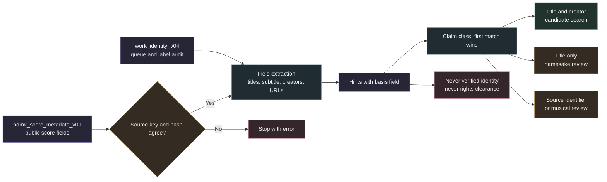

# Provenance hints

`samuged.provenance_hints` reads existing labels, upstream score fields and declarations and records structured hints for every source in the work identity queue. Most PDMX sources have a title but no usable creator. The hints give them search evidence without network access: collection codes, dates, collector notes, unattributed markers and archive references. Each source also receives a claim class and a search route.

Hints are claims and text patterns. They do not identify a work, verify a person or clear any rights.



## Inputs and binding

The module opens `work_identity_v04.sqlite` and `pdmx_score_metadata_v01.sqlite` through read only SQLite URIs. Every queue row must have a `track_metadata` row. A score metadata row must belong to a queue source and carry the same `source_sha256`, otherwise the build stops. Both input files are hashed before and after the build, and a change stops it.

## Hint types

Each hint row stores `source_key`, `hint_type`, `value`, `basis_field` (for example `score.subtitle` or `track.original.composer`) and `evidence_json`. One row is kept per source, type and value. The first field in a fixed order supplies the basis.

| Hint type | Source fields | Value and evidence |
| --- | --- | --- |
| `collection_code` | Titles, subtitle | Code such as `JJo6.15` or `Roose.0097`, with prefix, number and `mapping: unmapped_requires_review` |
| `catalogue_number` | Titles, subtitle | Classical catalogue form such as `BWV 1007`, `Op 27` or `Hob XVI:52` |
| `year_claim` | Creators, or titles and subtitle with a date context word | Year or range such as `1776-1791`, with a short text window |
| `life_dates_claim` | Creators | Birth and death years next to a name, with the name text |
| `named_creator_extracted` | Creators | Name from `Urheber: <name>`, `<name> (1670-1738)` or `<name>, 1712-1786`, role `composer_claim_unverified` |
| `collector_attribution` | Creators (`after ...`), any field (`noted by`, `collected by`, `sung by`, `transcribed by`, `arr.`, `arranged by`, `setting by`) | Text fragment up to 120 characters, role collector, arranger, transcriber or performer source |
| `unattributed_claim` | Creators | Raw text classified as unattributed, such as `Traditional`, `anon.`, `Urheber unbekannt`, `Unknown` or `?` |
| `generic_uploader_artist` | Artist fields | `Misc ...`, `Anonymous` or `Various` |
| `standardized_title_claim` | Titles, subtitle | Text after `Bezeichnung standardisiert:`, language `de` |
| `dance_instruction` | Subtitle | Playford style instructions such as `Longways for as many as will.` |
| `setting_number` | Titles, subtitle | Number from `2nd Setting` or `setting 2` |
| `external_reference` | Any field and the score URL | Full URL for public archive records, the domain only for anything else |
| `upstream_pd_declaration` | Score license and public domain flags | Declared license with both flags, license id, version and URL and `declaration_not_clearance: true`. A `publicdomain` license with both flags false adds `declaration_conflict: true` and the reason `upstream_pd_declaration_conflict` |
| `identifier_only_title` | Label audit | Title whose status is `identifier_only` |

Full URLs are kept only for vwml.org, hymnary.org, imslp.org, themorrisring.org, abcnotation.com, tunearch.org, thesession.org, archive.org, cpdl.org, library.efdss.org and MuseScore score pages. Other URLs keep only their domain, so profile pages and private hosts are not copied.

Collection codes are stored as codes. Mapping a prefix such as `JJo` or `PLFD` to a manuscript or printed collection needs review and is not asserted here. Catalogue prefixes, ordinary words and abbreviations (`Op`, `No`, `Vol`, `Part`, `Symphony`, `Psalm`, `ID` and similar) never form a collection code. A code needs a dot before the number, two capital letters in the prefix or a dotted number, which excludes words such as `Psalm23`. `after ...` counts as a collector note only in creator fields, because titles such as `After the Ball` are common.

## Claim classes and search routes

Every condition is checked and recorded in `reasons_json`. The first matching class is assigned.

| Order | Claim class | Condition | Search route |
| --- | --- | --- | --- |
| 1 | `identifier_only_source` | Title status is not `usable` | `source_identifier_or_musical_review` |
| 2 | `named_creator_claim` | Queue creator is a named claim under the current classifier, or a name was extracted | `title_and_creator_candidate_search` |
| 3 | `dated_anonymous_source` | Unattributed or standardized title claim together with a year or life dates | `title_only_namesake_review` |
| 4 | `traditional_collection_transcription` | Collection code, collector note or `Misc tunes` / `Misc Traditional` artist | `title_only_namesake_review` |
| 5 | `hymn_or_sacred_reference` | hymnary.org reference, `Misc Praise Songs` artist or Hymn, Psalm or Chorale in a title | `title_only_namesake_review` |
| 6 | `unattributed_traditional` | Unattributed claim | `title_only_namesake_review` |
| 7 | `title_only_unclassified` | No specific signal | `title_only_namesake_review` |

The queue creator is checked again with the current `creator_kind`, so labels such as `Urheber unbekanntDatum ...` or `?` that the earlier audit treated as names do not open a creator search. Every row carries `identity_status: unverified` and `rights_clearance: not_established`.

## What the hints never establish

- A collection code, year or life date does not identify the manuscript, the work or the person.
- An extracted name is a composer claim from an upload label. It may be an arranger, a collector or a wrong attribution.
- A public domain declaration by an uploader is not clearance of the composition, the arrangement or the transcription.
- A shared title is not a shared work. Title only routes require review of every namesake.

## Output

`provenance_hints_v01.sqlite` holds `provenance` (policy `provenance-hints-v1`, input hashes, creation time, `identity_verified = 0`, `rights_clearance = not_established`), `sources`, `hints` and `claim_class`. The build refuses an existing output, keeps a 10 GiB storage reserve, limits the database to about 1 GiB, writes in a temporary directory and links the finished file into place.

## Commands

```sh
source .venv/bin/activate
python -m samuged.provenance_hints prepare \
  --work-index /path/to/work_identity_v04.sqlite \
  --score-metadata /path/to/pdmx_score_metadata_v01.sqlite \
  --output /path/to/provenance_hints_v01.sqlite
python -m samuged.provenance_hints summary --hints /path/to/provenance_hints_v01.sqlite
python -m samuged.provenance_hints export --hints /path/to/provenance_hints_v01.sqlite \
  --output /path/to/provenance_hints_v01.jsonl.gz --max-output-mb 256
```

`summary` reports claim classes per dataset and hint counts per type. `export` writes one JSON line per source with its hints, class, route and status fields. It refuses an existing output and stops when the compressed file would exceed the size limit.
