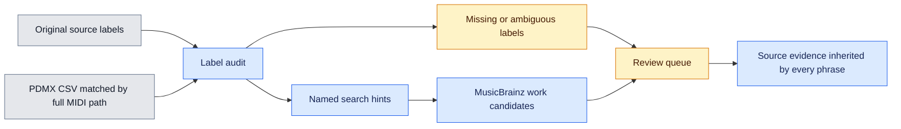

# Source metadata audit

The audit checks every source record before external work lookup. It adds search hints with their origin and keeps original labels intact. It does not confirm a composer or grant music reuse permission.



## Per source fields

| Field | Meaning |
| --- | --- |
| `original` | Original title, artist and composer from the metadata index |
| `upstream` | Selected PDMX title, song name, artist, composer, genre and score declaration fields |
| `search_title`, `title_basis` | Title used for lookup and the field it came from |
| `search_creator`, `creator_basis` | Creator hint and its source, including an explicitly unverified artist role |
| `title_status` | Usable, missing, suspected encoding damage or identifier only |
| `creator_status` | Named claim, missing, unattributed, generic or ambiguous, or suspect |
| `gaps` | Unresolved identity and rights fields |
| Input hashes | Exact metadata index, source MIDI and PDMX CSV bindings |

`named_claim` describes the source label. It does not establish that the label is a person, the composer or a rights holder. When a composer is missing, a named `artist_name` may become a lookup hint. Its role stays `upstream_artist_role_unverified`. Labels such as `Misc tunes`, `Traditional`, `Anonymous`, `after ...` and `arr. ...` do not become composer names.

A title containing only an ID is not sent as a song name. Suspected encoding damage stays visible for review rather than being repaired by guessing. These checks are heuristics and may flag legitimate labels. Raw text is preserved for correction.

All source records retain unresolved composition, arrangement and performance clearance. A `publicdomain` score declaration is recorded separately and cannot remove those gaps automatically.

## Running the audit

```sh
source .venv/bin/activate
python -m samuged.track_metadata \
  --metadata /path/to/metadata_usage.sqlite \
  --catalog /path/to/combined_catalog.sqlite \
  --pdmx-csv /path/to/pdmx.csv \
  --work-index /path/to/work_identity.sqlite \
  --output /path/to/work_identity_audited.sqlite
```

The output is a new index. The PDMX join uses the full archive MIDI path, requires complete selected source coverage and rejects duplicate paths. Input hashes, SQLite integrity and foreign keys are checked. Initialization requires 12 GiB free space, preserving the 10 GiB reserve while building the derived index.

Changed search labels invalidate old automatic candidates in the new index. Existing human reviews or rights observations block such a change until they are reconciled explicitly. The previous index remains available for comparison.

## Lookup normalization

Work lookup version 2 compares accents and apostrophes consistently. Creator word order may differ. Initials can agree with full names only when token counts match and a full name token also agrees. A surname alone cannot confirm a full name match. These rules create candidates only. They do not measure musical similarity or prove identity.

Search and phrase evidence results include `source_metadata_audit` when the audited index is used. A phrase therefore retains the source of its search hints and the unresolved gaps of its original MIDI.

## Review boundary

The audit is complete only as a source coverage check. It does not mean every musical work is identified. Classical catalogue numbers, translations, movements, traditional works and inconsistent attribution need further review. Evaluate work matching against independent evidence before running a large external lookup campaign. The MLC access and its ownership data terms remain a separate prerequisite.

## Hints from duplicate MIDI files

The optional `duplicate_hints(input_index, output_index)` Python function creates another index and compares exact source MIDI hashes. A missing creator may receive a named hint from an equal byte copy, with donor source keys and a separate `equal_MIDI_bytes_creator_hint` basis. Multiple normalized names are a conflict and do not fill the field. Donor details are capped at 20 with an explicit truncation flag. Musical hash similarity is not used for this step.

Equal bytes establish a copy relationship only. They do not verify the song title, authorship or rights. Duplicate hints stay unverified, and corpus permissions are never copied between sources. Existing human reviews block automatic changes.

Use `python -m samuged.work_identity search --index /path/to/audited.sqlite --gap creator_unresolved` to find missing creator evidence. Other gap values include `title_suspect_encoding`, `title_identifier_only`, `creator_role_unverified`, `duplicate_creator_hint_unverified`, `conflicting_duplicate_metadata` and the three rights scopes. Phrase results carry the same source audit.

Work lookup also searches MusicBrainz aliases and checks the canonical title or alias against the source label. Creator agreement is required. Transient HTTP 429 and 503 responses have at most three attempts with increasing pauses. Numeric `Retry-After` values up to 60 seconds are respected. Larger or date based cooldowns stop the run for later resumption. Every attempt counts against the request budget.
