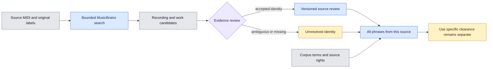

# Work identity and rights evidence

This layer connects source MIDI files to musical work candidates. It keeps identity separate from permission to use the music. It does not change phrase extraction or the published dataset.



## Evidence model

The work index is a separate SQLite file. Initialization includes every source record, including files without usable labels. The input metadata hash and each original MIDI hash bind the index to its inputs.

| Record | Meaning |
| --- | --- |
| `queue` | Source, original labels and search state |
| `work_candidates` | Work MBID, optional recording MBID and lookup evidence |
| `cache` | Projected core API response, URL, hash and retrieval time |
| `reviews` | Append only identity decisions with reviewer, evidence and reasoning |
| `rights_observations` | Versioned ownership or license claims with territory, rights layer, intended use and evidence |
| `provider_access` | External data access state, including unavailable providers |

Search states are `pending`, `missing_labels`, `candidate`, `no_candidate` and `error`. A query that finds nothing does not establish that the work is absent from the database. Errors remain retryable. A request budget leaves the unfinished source pending and keeps completed lookups cached.

Lakh uses recording title and artist labels, followed by recording to work relationships. Other corpora use work title search and writer label checks. Only normalized label agreement creates candidates. Alternate spellings, incomplete writer names, arrangements and medleys may remain unresolved. No musical fingerprint comparison is implemented in this layer.

An accepted review means a reviewer accepted the source to work link. It is not a copyright clearance. The latest review for a source controls its current identity. A later unresolved or rejected decision removes the previously accepted work from phrase results. Keep enough evidence to justify this decision, such as an original score link and a documented musical comparison. Do not accept a candidate from a title match alone.

Search by source title, creator or work MBID with `python -m samuged.work_identity search --index /path/to/work_identity.sqlite --text "How Will I Know"`. Results remain candidates. Counts distinguish candidate links from distinct work IDs. Multiple recording versions can point to the same work.

## Phrase inheritance

`phrase_evidence` joins phrases to their source at read time. It returns phrase boundaries, source hash, candidate works, the latest identity review and existing corpus terms. Corrections apply to every linked phrase without copying a rights decision into hundreds of rows.

The result binds the metadata and catalog hashes and rejects changed inputs. Calls are bounded to 500 phrases. Hash verification is intended for offline review and should not run on every browser animation frame.

The `observe_rights` Python interface records a claim for a composition, arrangement or transcription or performance. Each claim requires a work candidate, holder, territory, intended use, license declaration, conditions, metadata license, evidence URL and reviewer. Claims remain `claimed_unverified`. The MLC claims are refused while access is unavailable. No claim changes identity or grants permission.

The returned `midi_publication_clearance`, `audio_publication_clearance` and `new_music_reuse_clearance` stay `not_established`. Corpus license declarations, known authors, absent copyright events and accepted work identities do not grant these permissions. Composition, arrangement or transcription and performance rights need separate evidence. Territory and intended use also matter.

## Local use

```sh
source .venv/bin/activate
python -m samuged.work_identity init \
  --metadata /path/to/metadata_usage.sqlite \
  --output /path/to/work_identity.sqlite
python -m samuged.work_identity pilot \
  --index /path/to/work_identity.sqlite \
  --dataset lakh --sources 20 --requests 50
python -m samuged.work_identity status --index /path/to/work_identity.sqlite
```

The pilot uses one process with an ownership lock, at least 1.1 seconds between network calls, a 15 second request timeout and a 1 MiB response limit. Transient HTTP 429 and 503 responses have up to three attempts with increasing pauses and a bounded server cooldown. Other failures stop the current run. Every network attempt counts against the request budget. Cached successes survive a restart. The client uses a fixed HTTPS host and refuses redirects. Initialization requires a 10 GiB storage reserve plus a 1 GiB output budget. No corpus download is required.

Use `review` to append an identity decision and `phrases` to inspect inherited evidence:

```sh
python -m samuged.work_identity review \
  --index /path/to/work_identity.sqlite \
  --source-key SOURCE_KEY --work-id WORK_MBID --decision unresolved \
  --reviewer REVIEWER --evidence-url https://example.org/source \
  --reasoning "Evidence still needs musical comparison"
python -m samuged.work_identity phrases \
  --index /path/to/work_identity.sqlite \
  --metadata /path/to/metadata_usage.sqlite \
  --catalog /path/to/catalog.sqlite --source-key SOURCE_KEY
```

## External sources

[MusicBrainz API](https://musicbrainz.org/doc/MusicBrainz_API) supports recording and work lookups. [Core data](https://musicbrainz.org/doc/MusicBrainz_Database) includes work identifiers, ISWC, authors and relationships. This layer retains those fields under [CC0](https://musicbrainz.org/doc/About/Data_License). It excludes search relevance scores, tags, ratings, annotations, edit history and lyrics. The cache contains projected core fields, not raw search payloads.

[The MLC data programs](https://www.themlc.com/data-programs-all) require enrollment through the Data Access Hub. Until authorized access and applicable data terms are available, `provider_access` records `access_required`. This module does not call an undocumented API or label unavailable ownership data as checked. The MLC is an ownership information source, not a universal MIDI redistribution license.

[ISWC](https://www.iswc.org/iswc) identifies a musical work. It does not establish current ownership shares or permission to distribute a transcription. [TONO](https://www.tono.no/faq-items/kan-jeg-bruke-noen-takter-fra-et-annet-verk/) describes permission requirements for protected excerpts. Keep unresolved cases visible rather than converting them to allowed or prohibited.

## Remaining work

Review the pilot before running the complete queue. Matching accuracy has not been measured. Obtain The MLC access and verify its response contract and metadata redistribution terms before implementing an ownership importer. Store any future ownership evidence with its territory, scope, retrieval date and conditions. Do not publish expansion data from candidate matches or source declarations alone.

## Source label audit

[Audit source labels](track_metadata.md) before expanding lookup coverage. The audit preserves original values and records additional PDMX artist hints with an unverified role. Phrase evidence and search results include this audit when present. Lookup version 2 also handles creator word order, initials, accents and apostrophes while keeping matches as candidates.

Lookup version 3 records the match basis for each new candidate: source creator provenance, query labels, canonical or alias title agreement, creator agreement and the number of distinct work candidates returned. Initials remain an explicitly weaker candidate match. Multiple works remain ambiguous. Musical comparison is marked `not_performed` and source identity remains unverified. Earlier candidate evidence retains its original format, without invented match details. A single candidate is not proof of identity, because search results are bounded and names can collide.
