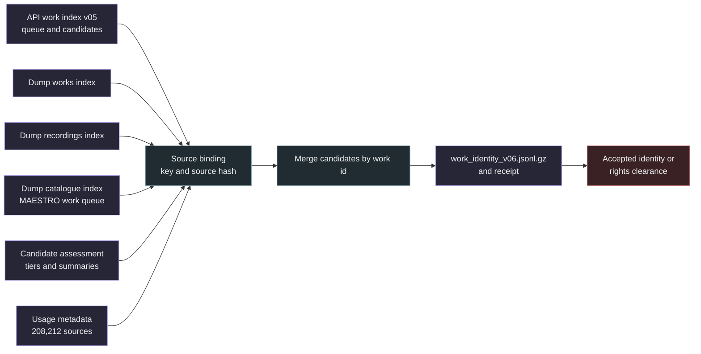

# Work identity merge

This layer writes one portable row per source that brings together every work identity index. It reads the API work index (v05), the offline dump works index, the offline dump recordings index, the optional offline dump catalogue index, a candidate assessment and the usage metadata export, all read only. The result is a gzip JSON lines file sorted by source key with a receipt next to it. It is the planned v06 export. It does not review candidates and it is not a rights clearance.



## Binding

The API queue defines the rows. Every source key of the dump queues must exist in the API queue with the same `source_sha256`. The dump catalogue index is optional, and when it is given its keys bind the same way. Every assessed source must exist in the API queue. The usage metadata must hold exactly the API queue keys with the same hashes. A candidate whose evidence claims a verified source identity, or whose provider differs from its index, stops the run. Inputs are hashed before and after the run, and the work index lock is held when its lock file exists. Failures leave no output.

## Row schema

| Field | Meaning |
| --- | --- |
| `source_key`, `source_sha256`, `dataset_id`, `title`, `creator`, `query_kind` | API queue labels, unchanged |
| `api_status` | API queue status: `candidate`, `no_candidate`, `pending` or `missing_labels` |
| `dump_works_status` | Dump works queue status, null when the source is absent there |
| `dump_recordings_status`, `dump_recordings_reason` | Dump recordings queue status and reason, null outside the Lakh recording rows |
| `dump_catalogue_status`, `dump_catalogue_reason` | Dump catalogue queue status and reason, null when no catalogue index is given or the source is absent there |
| `candidates` | One entry per distinct MusicBrainz work, sorted by work id |
| `best_tier`, `review_priority`, `assessment_reasons` | Assessment source summary, null or empty when unassessed |
| `identity_status` | `candidate_unverified` when a candidate exists, otherwise `unresolved` |
| `rights_clearance` | Always `not_established` |
| `policy` | `work-identity-merge-v3` |

Each candidate has `work_id`, `work_title`, `iswcs`, `providers`, `writers` (role, artist id and name for composer, writer, lyricist and librettist relations), `best_tier`, `title_agreement`, `creator_agreement` and `counts_as`, the work id the assessment counts this candidate as (the catalogue work whose part or version it is, or the lowest id of its duplicate family), null when it counts as itself or was not assessed. Providers are `musicbrainz` (API), `musicbrainz_json_dump` (dump works), `musicbrainz_fullexport` (dump recordings) and `musicbrainz_fullexport_catalogue` (dump catalogue). Recording rows of the same work collapse into one candidate. The work title prefers the catalogue, then the most recent dump, then the API title. The candidate tier is `conflict` when any provider's assessment is a conflict, otherwise the most favourable assessed tier. Agreement fields keep the strongest recorded value: canonical, recording or catalogue attribute title, then alias, catalogue title and quoted nickname; full name tokens or composer identity, then initials, single namesake composer and surname subset.

`pending` API rows are historical. The API chain stopped before reaching them and the dump indexes cover those sources. Title only rows of the dump works index stay in that index for review and are not candidates here.

## Commands

```sh
python -m samuged.work_identity_merge prepare \
  --work-index snapshot/work_identity_v05.sqlite --offline-index work_identity_offline_v01.sqlite \
  --recordings-index work_identity_offline_recordings_v01.sqlite --catalogue-index work_identity_offline_catalogue_v01.sqlite \
  --assessment candidate_assessment_v02.sqlite --metadata snapshot/usage_metadata.jsonl.gz \
  --output work_identity_v06.jsonl.gz
python -m samuged.work_identity_merge status --export work_identity_v06.jsonl.gz
```

The receipt `work_identity_v06.jsonl.gz.receipt.json` records input paths and hashes, row and candidate counts, counts per status, tier, dataset and provider combination, the output hash, `identity_verified: false` and `rights_clearance: not_established`. `status` recomputes the counts from the rows and reports whether they still match the receipt.
