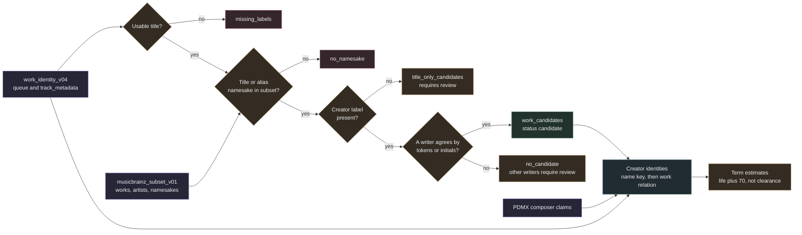

# Offline work identity from the dump subset

`samuged/work_identity_offline.py` applies the work candidate rules of the MusicBrainz API lookup to every source in the immutable `work_identity_v04.sqlite` queue, using the local subset built by `musicbrainz_dump` instead of the network. It writes one new sidecar index with work candidates, title only rows for review, creator identity candidates and composition term estimates.

Nothing in the index is a verified identity or a rights clearance. Work candidates are candidates, title only rows require review, creator identities are unverified candidates and term estimates are estimates for the composition layer only. Every record states `identity_verified` false (or an unverified status) and `rights_clearance` `not_established`.



## Inputs

| Input | Use |
| --- | --- |
| `work_identity_v04.sqlite` | `queue` titles, creators and hashes, `track_metadata` title status and creator basis. Opened read only. The mutable `v05` index is never opened. |
| `musicbrainz_subset_v01.sqlite` | Works, work titles and aliases, title namesake counts, artists, artist names and name namesake counts. Both the works pass and the artists pass must be complete and untruncated, and the works pass must have been built from the same `v04` and score metadata files (checked by sha256). Every creator key derived by the offline pass must be in the subset `creator_set`, so a stale subset stops the build instead of producing `no_match`. |
| `pdmx_score_metadata_v01.sqlite` | `composer_claim` for PDMX sources, cleaned with `creator_search_names` from `musicbrainz_dump`. Each row must match the queue `source_sha256`. |

All three inputs are hashed before the build and again at the end. The build stops when any hash changed.

## How it mirrors the API rules

The API lookup (`work_identity.resolve`, policy `work-candidates-v3`) searches works by title or alias and keeps a work when a composer, writer or lyricist agrees with the source creator. The offline pass applies the same rules to the subset:

1. The source title `T` is `label(queue.title)` and the creator `C` is `label(queue.creator)`.
2. The namesake works of `T` are the subset works whose normalized canonical title or alias equals `T`. They are ranked with canonical titles first, then by performance count descending, then by work id. Every namesake work is examined for writer agreement. Writers are cached per work and results per title and creator pair, so popular titles stay cheap.
3. A namesake work becomes a candidate when at least one artist relation of type composer, writer, lyricist or librettist agrees with `C` through `creator_agreement` on either the artist name or the sort name. Agreement is `normalized_tokens` (same tokens in any order) or `initials_candidate` (same token count, one full token of at least three letters shared and the rest matching by initial).

The rule runs for every dataset, including Lakh. Lakh creators are performer labels, so a Lakh candidate means the performer is also credited as a writer of a work with that title. This is legitimate but partial evidence. `match_basis.source_creator_role` records `performer_label` for Lakh, `artist_label_role_unverified` when the creator came from the upstream PDMX artist field and `composer_label` otherwise.

Candidate rows keep the API index shape: `work_candidates(source_key, work_id, recording_id, title, evidence_json, match_status)` with an empty `recording_id` and `match_status` `candidate`. The evidence names provider `musicbrainz_json_dump`, policy `work-candidates-v3-dump`, the CC0 license, and a `dump` block (dump name, timestamp, replication and schema sequence, `work.tar.xz` sha256) instead of a request URL and retrieval date. `match_basis` holds the query labels, title and creator agreement, `title_namesake_count` (canonical title namesakes across the whole dump), `title_alias_namesake_count`, the number of distinct candidates, `linked_work_count` (all namesake works examined), and `musical_comparison` `not_performed`. The projected work record is attached with a `relations` list in the API shape, so `candidate_assessment` reads writers from both providers the same way.

## Source statuses

| Status | Meaning |
| --- | --- |
| `missing_labels` | No usable title (empty label or `title_status` other than `usable`) |
| `no_namesake` | No work in the dump has this title or alias |
| `title_only_candidates` | Namesakes exist but the source has no creator label |
| `no_candidate` | Namesakes exist and the source has a creator, but no writer of any namesake work agrees |
| `candidate` | At least one work candidate was recorded |

`no_namesake` and `no_candidate` do not establish that the work is absent from MusicBrainz or from the repertoire. They describe this dump and these rules only.

## Title only rows for review

`title_only_candidates` lists namesake works for two kinds of sources, using the same ranking as above and at most 50 works per source:

- `title_only_candidate_requires_review` for sources with a usable title and no creator label.
- `title_matches_other_writers_requires_review` for sources whose creator agrees with none of the writers.

Each row keeps the writers (name, role, artist id), the title agreement, the namesake counts, ISWC presence, the performance count and the dump block. When a title has more than 50 namesakes the evidence sets `truncated` and `ambiguous_title`. A shared title is never evidence that a source realizes the work; a reviewer has to compare the music.

## Creator identities

`source_creators` records each creator key per source with its basis: `queue_creator` for the queue creator of any dataset and `score_composer_claim` for cleaned PDMX composer claims. The dataset is stored so consumers can leave out Lakh performer labels. Keys with fewer than three letters or digits are skipped, as in the subset, and the number of distinct skipped keys is kept in the provenance selection.

`creator_identities` matches each key to dump artists by exact name key on the artist name or sort name, falling back to aliases only when no name or sort name matches. Popularity is never used to choose between namesakes. `person_namesakes` and `total_namesakes` count artists whose name or sort name has the key across the whole dump and `alias_namesakes` counts artists that carry it only as an alias, so an alias only match with 0 and 0 is not a sign of uniqueness. The export carries `alias_namesakes` for each creator.

| Status | Rule |
| --- | --- |
| `disambiguated_by_work_relation` | Exactly one artist with this key is also a writer with full token agreement (`normalized_tokens`) on a canonical title candidate (`canonical_title_normalized`) for a source that carries the key. Initials or alias only candidates never narrow the identity; the name based statuses below apply instead |
| `single_person_candidate` | Exactly one artist typed `Person` has this key |
| `ambiguous_persons` | Several `Person` artists have this key (up to ten ids are listed) |
| `non_person_match` | Only groups, orchestras, choirs, characters, other or untyped artists have this key |
| `no_match` | No artist in the subset has this key |

The evidence states `identity_status` `candidate_unverified`, `rights_clearance` `not_established` and the matching rule `name_key_exact_then_work_relation`. A single person in MusicBrainz with a given name may still be a different person from the source's composer, especially for traditional and amateur composers that MusicBrainz does not list.

## Term estimates

`term_estimates` is filled only for `single_person_candidate` and `disambiguated_by_work_relation`, and only when the chosen artist is typed `Person`. A group, orchestra or untyped artist keeps its identity row with `term_estimate_skipped` `artist_type_not_person` in the evidence, because a dissolution date is not a life span. The rule is `life_plus_70`: the death year is the year of the artist end date and the threshold year is the death year plus 70.

| Status | Rule |
| --- | --- |
| `likely_expired` | The threshold year is before the current UTC year |
| `likely_in_term` | The death year is known and the threshold is not yet passed |
| `living_or_unknown_end` | The artist is not ended or has no end date |
| `unknown` | Any other case, for example an unreadable end date |

Life plus 70 years applies in the EEA and many other states; the United States and some others use different rules. The estimate covers the composition layer of one writer only. It is not clearance for arrangements, transcriptions, editions, lyrics by other writers or performances, and a work with several writers runs until the last of them qualifies. Each estimate records `estimate_not_clearance` true and this jurisdiction note.

## What it never establishes

- That a source MIDI file realizes a work. No musical comparison is performed.
- That a creator label names the person in MusicBrainz with the same name.
- That a composition, arrangement or recording is free to use in any territory.
- That a missing namesake or a disagreeing writer rules a work out.

## Index and provenance

The output is created once in a temporary directory and linked into place, so an existing file is never replaced. The build refuses to start with less than 10.75 GiB free and caps the database at 2 GiB. The `provenance` row records the policy, the sha256 of each input, the dump block with the subset provenance rows, the selection (`dataset`, `limit`, `truncated`), `identity_verified` 0 and `rights_clearance` `not_established`. The output `queue` uses the API column set with `query_kind` `work` for every source, because the offline pass only resolves works.

## CLI

```bash
python -m samuged.work_identity_offline prepare \
  --work-index research_local/corpus_expansion_v02/snapshot_full_v01/work_identity_v04.sqlite \
  --subset research_local/corpus_expansion_v02/musicbrainz_subset_v01.sqlite \
  --score-metadata research_local/corpus_expansion_v02/pdmx_score_metadata_v01.sqlite \
  --output research_local/corpus_expansion_v02/work_identity_offline_v01.sqlite [--dataset pdmx] [--limit 20000]
python -m samuged.work_identity_offline status --index research_local/corpus_expansion_v02/work_identity_offline_v01.sqlite
python -m samuged.work_identity_offline export --index research_local/corpus_expansion_v02/work_identity_offline_v01.sqlite \
  --output research_local/corpus_expansion_v02/work_identity_offline_v01.jsonl.gz [--max-output-mb 512]
```

`--limit` keeps the first N queue rows by source key (after the dataset filter) for smoke runs, and the provenance marks the selection as truncated. `status` reports queue statuses per dataset, candidates, distinct works, title only rows and sources, and creator identity and term estimate statuses. `export` writes one JSON line per source with its status, candidates, up to 50 title only works, creators with identity status and term estimate, the policy and the dump name. It refuses an existing output and stops when the compressed file would exceed the size bound. The index feeds `candidate_assessment` through `--offline-index`.
