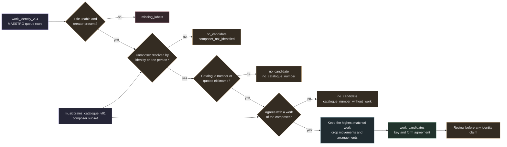

# Offline catalogue candidates from the full export

`samuged/work_identity_offline_catalogue.py` matches MAESTRO rows of the immutable `work_identity_v04.sqlite` to MusicBrainz works through composer identity and catalogue numbers. It uses a composer subset of the [full export](musicbrainz_fullexport.md) instead of the network. It writes one new sidecar index with work candidates and per source match counts. The mutable `v05` index is never opened.

Nothing in the index is a verified identity or a rights clearance. A candidate says that a label agrees with a database entry on composer, catalogue number and genre words. Every evidence record states `identity_verified` false and `rights_clearance` `not_established`, and the provenance row enforces both with `CHECK` constraints.



## Inputs

| Input | Use |
| --- | --- |
| `work_identity_v04.sqlite` | MAESTRO `queue` rows (`dataset_id` `maestro`) and their `track_metadata` title status and creator basis. Opened read only. Every MAESTRO row is processed whatever its API status. Lakh and PDMX rows are never read. |
| `work_identity_offline_v01.sqlite` | `creator_identities` rows with status `disambiguated_by_work_relation` or `single_person_candidate`, which give the composer MBID. Opened read only. |
| Full export directory | `SHA256SUMS` and `mbdump.tar.bz2`. The archive is hashed against `SHA256SUMS` before any member is read. It is streamed, never extracted and never executed. |
| `musicbrainz_catalogue_v01.sqlite` | The composer subset written by `subset`. It must hold exactly one provenance row with policy `musicbrainz-fullexport-catalogue-subset-v1`, must not be truncated and must have been built from the same work and offline indexes (checked by sha256). |

All inputs are hashed before the build and again at the end. The build stops when a hash changed.

## Rule

1. A row is `missing_labels` when its normalized title is empty (`missing_title`), its `title_status` is not `usable` (`title_not_usable`) or its normalized creator is empty (`missing_creator`). Creator components are split on ` / `, and empty components are ignored.
2. A creator component resolves in two ways. A name key with an offline identity of status `disambiguated_by_work_relation` or `single_person_candidate` resolves to that MBID (`composer_identity`). Otherwise the name resolves when exactly one person in the export has that name or sort name (`composer_name_single_namesake`, status `single_person_namesake`). The subset keeps every person with a queue name, so this count is complete. Groups never resolve by name, and two namesakes never resolve. A row with no resolved component is `composer_not_identified`.
3. The title gives catalogue keys for each resolved composer. A key is the system prefix plus the normalized number, for example `op27no2` for Op. 27 No. 2, `op8no10` for `op. 8: No. 10`, `s244no10` for S. 244/10 and `d960` for D. 960. The opus system applies to every composer. The other systems apply only when the composer surname appears in the table below. A title with no key and no usable nickname is `no_catalogue_number`.
4. Matching works are the works whose own title, alias or attribute carries a key. For the first creator component, the works are the composer works, with the roles composer, writer, librettist and lyricist. For later components of an `A / B` creator, the arranger, orchestrator and the other creator roles count as well. Keys are tried from the most specific to the least specific, and the first key with a hit decides. Every key except a bare opus or bare S. number is specific, for example `op27no2`, `woo80` and `d960`. A bare opus or bare S. key, such as `op2` from Op. 2, is tried last. When an attribute and a title both match the same key, the match is recorded as an attribute match.
5. A nickname is used only when no catalogue key has a hit. It is a quoted text in the MAESTRO title (straight or typographic quotes or guillemets), folded, with at least six characters, and it must not consist only of tempo words such as `Molto vivace`. A top level work (a work without a parent) is indexed under its exact folded title or alias, the prefix of the title before `:`, `,`, `(` or ` from `, or a quoted text inside the title. So `Carmen: Acte II` and `Carmen, Act IV (Opera)` both index under `carmen`. There is no substring matching, so `Carmen Medley` does not match `carmen`, and a movement is never indexed.
6. The matched works are reduced to the works themselves, in this order.
   - (a) A matched work is dropped when one of its ancestors, up to three levels of parts, is also matched. The highest matched work stays.
   - (b) A work derived from a matched work through a link of type `arrangement`, `medley`, `based on`, `revision`, `later version`, `other version`, `orchestration`, a translation or a parody version is dropped. The check uses every matched work, so a work derived from a movement of a matched work is dropped too.
   - (c) A work whose title has the form `<title of another kept work>: <something>` is dropped. A work never counts its own titles and aliases, so a single work with an alias equal to its title before the colon is kept.
   - (d) A movement form is dropped when at least one work that is not a movement form remains. A movement form is defined below.
   - (e) For a bare opus key, a work whose own keys carry a numbered piece of the same opus, such as `op2no1` for the key `op2`, is dropped when a set level work remains. A set level work is a work whose own keys carry no numbered piece of that opus.

   The works removed in these steps are listed in the evidence as `matched_part_titles` (sorted, at most ten) and counted in `derived_or_part_works_dropped`. A parent whose own title and aliases carry no key is never matched, so it is never a candidate. A movement of such a parent stays as the candidate instead.

7. A bare opus key can match several separate works, each carrying the number in its own title or alias. Each such work becomes a candidate, unless a set level work is present (step 6 (e)). The evidence marks the key as not specific.
8. The key of the title, read from `in C-sharp minor`, `in D Major` or `in E flat major` (with ♭ and ♯ read as flat and sharp), is compared with the work `Key` attribute. The result is `agrees`, `disagrees` or `unknown` when either side has no key. A disagreement keeps the candidate and records the disagreement.
9. The genre words of the title are compared with the genre words of the work title, its aliases and the titles of its direct children. The words come from 36 genre families, such as sonata, etude, nocturne, fugue, variations, waltz and mass, each with its foreign and plural forms. The result is `agrees` when a family appears on both sides, `disagrees` when both sides carry families and none is shared, and `unknown` when either side has none. A disagreement keeps the candidate and records the disagreement.
10. At most 20 works are written per source, ordered by work MBID. A cut sets `parents_truncated` in the evidence and the truncated flag in `source_matches`. `status` counts the truncated sources.

### Movement forms

A title is a movement form when the text after its last colon has no catalogue number of its own and either starts like a movement label or has at most four words. A movement label starts with a roman numeral or a numbered label (`II.`, `No. 5`), or with a tempo, dance or form word such as Adagio, Allegro, Presto, Prelude, Fugue, Act or Book. A title without a colon is never a movement form.

- `Sonata no. 8, op. 13: II. Adagio cantabile` is a movement form.
- `Étude in F major, op. 10 no. 8: Allegro` is a movement form.
- `The Well-Tempered Clavier, Book I: Prelude and Fugue no. 5 in D major, BWV 850.2/850` is not, because its tail carries BWV 850.
- `Sonata for Piano no. 21 in C major, op. 53 “Waldstein”` is not, because it has no colon.

### Catalogue systems

| System | Title forms | Composer surnames |
| --- | --- | --- |
| `op` | Op. or Opus, with an optional No. (`op27`, `op27no2`) | Any |
| `woo` | WoO | Beethoven |
| `k` | K., KV or KK, with an optional second number after a slash (`k300k` and `k332` for K. 300k/332) | Mozart, Scarlatti |
| `d` | D. (Deutsch) | Schubert |
| `bwv` | BWV | Bach |
| `wq` | Wq. | Bach |
| `hob` | Hob. XVI:52 | Haydn |
| `s` | S. (Searle), with an optional second number after a slash or `no.` (`s244no18` for S. 244/18), and a letter suffix kept in the key (`s244c`) | Liszt |
| `l` | L. (Lesure or Longo) | Debussy, Scarlatti |
| `sz` | Sz. | Bartók |
| `hwv` | HWV | Handel |
| `bv` | BV | Busoni |
| `m` | M. | Franck |

Catalogue numbers are read from work titles and aliases. The attribute path stays in the code for completeness. It reads the attribute types Opus, BWV, Kochel, K, KV, Kirkpatrick, D, Deutsch, Hob, Hoboken, WoO, S, Searle, L, Lesure, Longo, HWV, Wq, Wotquenne, Sz, Szollosy, BV and M in the same way. The MusicBrainz data checked so far does not store catalogue numbers as work attributes. Only `Key` and society identifiers appear, so the attribute path adds no candidates on that data.

## Evidence

The evidence JSON uses provider `musicbrainz_fullexport_catalogue`, policy `work-candidates-v4-catalogue`, metadata license `CC0-1.0` and method `composer_identity_and_catalogue_number_agreement_not_MIDI_identity`. The `dump` block names the export, the archive sha256, the timestamp, the replication and schema sequence and the signature status.

`match_basis` records the following.

- The source creator basis, the query title and the query creator.
- `title_agreement` (`catalogue_number_attribute`, `catalogue_number_title` or `nickname_quoted`), the catalogue key and whether the key is specific.
- `key_agreement`, with the key of the title (`source_key`) and the key attribute of the work (`work_key`).
- `form_agreement`, with the genre families of the title (`source_forms`) and of the work (`work_forms`).
- `creator_agreement` (`composer_identity` or `composer_name_single_namesake`), with the composer MBID, name, MAESTRO creator component and identity status.
- Up to ten titles of the works that the reduction removed for this match, movements, arrangements and other derived works alike (`matched_part_titles`), the MBIDs of the same works (`related_work_ids`, at most 100) and the number of works removed for the source (`derived_or_part_works_dropped`).
- The number of candidate works for the source, whether there are several, and whether the list was cut.
- `musical_comparison` `not_performed` and `source_identity_verified` false.

The `work` block holds the work MBID, title and type. Its `relations` list the creator relations of the work (composer, writer, lyricist and the other creator types) with the artist MBID and name. `musical_work_license_status` is `unknown` and `rights_holder_status` is `not_established`.

## What it never establishes

- That a MAESTRO performance realizes the matched work. No musical comparison is performed.
- That a composer label names the same person in MusicBrainz. The rule compares names and the offline identity status only.
- That a shared opus number identifies one work. Several works of one composer can carry the same number.
- That a key or form agreement is a musical fact. Genre words and keys are labels, and a disagreement can come from a label alone.
- That a work is free to use in any territory.
- That a missing candidate rules a work out. The subset holds only works linked to the selected composers, so a work by any other composer is never found.

## Index and provenance

| Table | Content |
| --- | --- |
| `provenance` (subset) | Policy, dump block, input hashes with the composer names resolved, composer count, creation time, `identity_verified` 0 and `rights_clearance` `not_established` |
| `composers` | Artist ID, MBID, name, sort name, type and whether the artist was selected by MBID or by name |
| `works` | Work ID, MBID, title and type for the composer works, their parts down to three levels and the direct parents of kept parts |
| `work_composers` | Work ID, artist ID and creator role. Dedication and member relations are not kept |
| `work_aliases` | Work ID and alias for the kept works |
| `work_attributes` | Work ID, attribute type name and value. An allowed value is used when the attribute has no free text |
| `work_parts` | Parent work ID and part work ID for `parts` relations between kept works |
| `work_links` | Work0 (original), work1 and link type for every work to work relation between kept works, such as `parts` and `arrangement` |
| `provenance` (index) | Policy, input hashes, dump block, selection (dataset, query kind, limit, truncation, source count, parent cap, composer names and identified composers), creation time, `identity_verified` 0 and `rights_clearance` `not_established` |
| `queue` | Source key, source hash, dataset, title, creator, query kind `work`, status, reason and update time |
| `work_candidates` | Source key, work MBID, title and evidence, `match_status` `candidate` |
| `source_matches` | Composer components, resolved components, catalogue keys, matched work count (candidates and works removed by the reduction), candidate count and truncation flag per source that reached the catalogue step |

Each output is created once in a temporary directory and linked into place, so an existing file is never replaced. Both builds refuse to start with less than 10.75 GiB free, and both databases are capped at 4 GiB.

## CLI

```sh
python -m samuged.work_identity_offline_catalogue subset \
  --export research_local/corpus_expansion_v02/musicbrainz_fullexport/20261007-002147 \
  --work-index research_local/corpus_expansion_v02/snapshot_full_v01/work_identity_v04.sqlite \
  --offline-index research_local/corpus_expansion_v02/work_identity_offline_v01.sqlite \
  --output research_local/corpus_expansion_v02/musicbrainz_catalogue_v01.sqlite [--limit 2000] [--decompressor /usr/bin/lbzip2 -dc]
python -m samuged.work_identity_offline_catalogue subset-status --subset research_local/corpus_expansion_v02/musicbrainz_catalogue_v01.sqlite
python -m samuged.work_identity_offline_catalogue prepare \
  --work-index research_local/corpus_expansion_v02/snapshot_full_v01/work_identity_v04.sqlite \
  --offline-index research_local/corpus_expansion_v02/work_identity_offline_v01.sqlite \
  --subset research_local/corpus_expansion_v02/musicbrainz_catalogue_v01.sqlite \
  --output research_local/corpus_expansion_v02/work_identity_offline_catalogue_v01.sqlite [--limit 500]
python -m samuged.work_identity_offline_catalogue status --index research_local/corpus_expansion_v02/work_identity_offline_catalogue_v01.sqlite
```

`subset` verifies the archive and streams it once. `--limit` reads the first N lines of each table for smoke runs. The subset is then marked truncated, and `prepare` refuses it. An explicit `--decompressor` must be an absolute executable path. Without one, `lbzip2` is used when it is installed, and Python's `tarfile` otherwise.

`subset-status` prints the counts of the subset, including composers selected by MBID, works, relations, work links by type and attribute types. `prepare` takes the first N MAESTRO rows by source key when `--limit` is given, and the provenance marks the selection as truncated. `status` prints the counts of statuses, reasons, candidates, candidate sources, distinct works, title, key, form and creator agreement and truncated sources. Every command prints JSON and refuses an existing output file.
