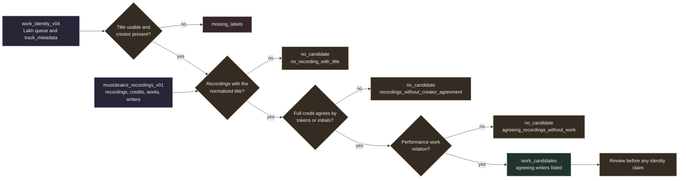

# Offline recording candidates from the full export

`samuged/work_identity_offline_recordings.py` applies the recording rule of the MusicBrainz API lookup to every Lakh queue row in the immutable `work_identity_v04.sqlite`, using the local [full export recording subset](musicbrainz_fullexport.md) instead of the network. It writes one new sidecar index with work candidates and per source match counts. The API index is never opened for writing.

Nothing in the index is a verified identity or a rights clearance. Work candidates are candidates. Every evidence record states `identity_verified` false and `rights_clearance` `not_established`, and the provenance row enforces both with `CHECK` constraints.



## Inputs

| Input | Use |
| --- | --- |
| `work_identity_v04.sqlite` | `queue` rows with `query_kind` `recording` and their `track_metadata` title status and creator basis. Opened read only. Every Lakh row is processed whatever its API status. The mutable `v05` index is never opened. |
| `musicbrainz_recordings_v01.sqlite` | The full export subset. It must hold exactly one provenance row with policy `musicbrainz-fullexport-subset-v1`, must not be truncated and must have been built from the same work index (checked by sha256). |

Both inputs are hashed before the build and again at the end. The build stops when either hash changed.

## Rule

The rule mirrors `resolve()` in `work_identity.py` for the recording kind, with the network replaced by the subset.

1. A row is `missing_labels` when its normalized title is empty (`missing_title`), its `title_status` is not `usable` (`title_not_usable`) or its normalized creator is empty (`missing_creator`). The API queue never sends rows without a creator to the lookup, so the offline pass does not either.
2. Recordings match when their normalized title equals the normalized source title and `creator_agreement` between the full joined credit string and the source creator is `normalized_tokens` or `initials_candidate`. The credit string is the credited names with their join phrases in position order, as the API returns it. A credit of several artists therefore agrees only with a creator label that names all of them. The agreement of each credited artist on its own is recorded in the evidence as information and does not change the rule.
3. For each matching recording the works come from `performance` relations. For each work the writers are composer, writer and lyricist relations whose artist name agrees with the source creator. An empty writer list is allowed, exactly as in the API.
4. One candidate row is written per source, work and recording. The source status is `candidate` when at least one row exists, otherwise `no_candidate` with the reason `no_recording_with_title`, `recordings_without_creator_agreement` or `agreeing_recordings_without_work`.

Matching recordings are ordered by recording MBID and capped at 50 per source. Works are ordered by work MBID and capped at 20 per recording. Each cap sets a truncation flag in the evidence and in `source_matches`, and `status` counts the truncated sources. The API inspects at most five search results and five works, so the offline pass can find candidates that the API did not reach.

## Evidence

The evidence JSON uses the keys of the API evidence with provider `musicbrainz_fullexport`, policy `work-candidates-v3-fullexport`, metadata license `CC0-1.0` and method `normalized_labels_names_or_initials_and_dump_relationship_not_MIDI_identity`. The `dump` block names the export, the archive sha256, the timestamp and the replication and schema sequence. `match_basis` records the source creator basis, the query title and creator, `recording_title_normalized` as title agreement, the credit agreement, the credited artists with MBID and agreement, the recording MBID, name and credit, the whole database recording namesake count, the matching recording count, the linked work count, both truncation flags, the number of distinct work candidates and `musical_comparison` `not_performed`. The `work` block holds the work MBID, title, type and the agreeing writers with role, artist MBID and name. `musical_work_license_status` is `unknown` and `rights_holder_status` is `not_established`.

## What it never establishes

- That a Lakh MIDI file realizes a recording or a work. No musical comparison is performed.
- That a credit or writer label names the person in MusicBrainz with the same name.
- That a composition or recording is free to use in any territory.
- That a missing recording, a disagreeing credit or a missing work relation rules a work out.

## Index and provenance

| Table | Content |
| --- | --- |
| `provenance` | Policy, input hashes, dump block, selection (`query_kind`, `limit`, `truncated`, source count and both caps), creation time, `identity_verified` 0 and `rights_clearance` `not_established` |
| `queue` | Source key, source hash, dataset, title, creator, `query_kind` `recording`, status, reason and update time |
| `work_candidates` | Source key, work MBID, recording MBID, work title and evidence, `match_status` `candidate` |
| `source_matches` | Recordings with the title, agreeing recordings, linked works and truncation flags per resolved source |

The output is created once in a temporary directory and linked into place, so an existing file is never replaced. The build refuses to start with less than 10.75 GiB free and caps the database at 2 GiB.

## CLI

```sh
python -m samuged.work_identity_offline_recordings prepare \
  --work-index research_local/corpus_expansion_v02/snapshot_full_v01/work_identity_v04.sqlite \
  --subset research_local/corpus_expansion_v02/musicbrainz_recordings_v01.sqlite \
  --output research_local/corpus_expansion_v02/work_identity_offline_recordings_v01.sqlite [--limit 2000]
python -m samuged.work_identity_offline_recordings status --index research_local/corpus_expansion_v02/work_identity_offline_recordings_v01.sqlite
python -m samuged.work_identity_offline_recordings export --index research_local/corpus_expansion_v02/work_identity_offline_recordings_v01.sqlite \
  --output research_local/corpus_expansion_v02/work_identity_offline_recordings_v01.jsonl.gz [--max-output-mb 512]
```

`--limit` keeps the first N Lakh rows by source key for smoke runs, and the provenance marks the selection as truncated. `status` reports statuses, reasons, candidates, candidate sources, distinct works and recordings and truncated sources. `export` writes one JSON line per source with its status, reason, match counts, candidates with credit, credit agreement and agreeing writers, the policy and the export name. It refuses an existing output and stops when the compressed file would exceed the size bound.
