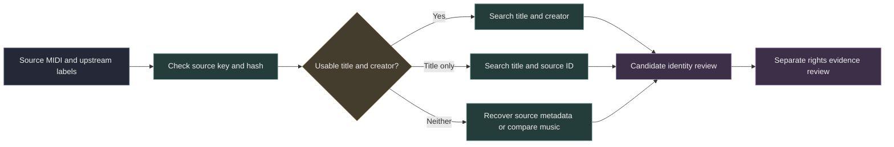

# Search recovery for unresolved tracks

A missing composer does not make a track unsearchable. It does make a title based match weaker. Keep the original source identifier, title variants, creator claims and source hash together. Search results remain candidates until a separate identity review establishes the connection.

The local search index covers every source packet. It supports accent insensitive title, creator and source path search. Sources with the same normalized query share a request group. They remain separate source records, with separate rights evidence. A request group is never a work identifier.



## Local commands

Activate the project virtual environment before using these commands. Build into a new file. The validated work index is read only.

```sh
python -m samuged.search_recovery prepare \
  --packets /path/to/source_search_recovery.jsonl.gz \
  --work-index /path/to/validated_work_identity.sqlite \
  --output /path/to/source_search.sqlite

python -m samuged.search_recovery search \
  --index /path/to/source_search.sqlite \
  --text 'The Dusty Miller' --limit 20
```

Preparation requires full source coverage and matching hashes. It rejects duplicate source keys, unexpected routes and packets that claim verified identity or rights clearance. The output is capped at 512 MiB and preparation preserves the storage reserve. Search treats punctuation and operators as text and returns at most 100 records.

## Recovery order

1. Use an exact upstream score ID or full archive path to recover metadata. Derived public links are unverified until checked. A publisher or uploader is not automatically the composer.
2. Retain original and normalized labels. Group equivalent queries to avoid repeated requests. Preserve distinct musical sources and conflicting labels.
3. Search titles and aliases without a creator only in a separate review queue. A unique title result still does not establish musical identity. Generic names and shared titles need stronger evidence.
4. Compare symbolic music where suitable references and their conditions permit it. Transposition, ornaments, arrangement changes and incomplete MIDI need explicit comparison limits. Do not infer permissions from musical similarity.
5. Attach an accepted identity and rights observations to the source, then inherit those links through the source key of each phrase. Unknown conditions remain unknown.

## Provider conditions

[MusicBrainz search](https://musicbrainz.org/doc/MusicBrainz_API/Search) supports work titles and aliases. Respect its service limits. Preserve source URLs, retrieval dates and ambiguity. Metadata licenses do not grant permission to reuse the music.

[PDMX](https://github.com/pnlong/PDMX) provides separate metadata files. Its documented license conflicts must remain visible in source evidence. The metadata archive is not part of the existing local MIDI acquisition. Recovering it requires a separate bounded acquisition decision and adequate storage.

[The Session data conditions](https://github.com/adactio/TheSession-data/blob/main/LICENSE.md) include a restriction on processing its material with large language models. This workflow does not ingest that database. Any proposed integration needs a separately permitted workflow and review of its database and content conditions.

An unavailable public score page is recorded as unavailable. Do not bypass access controls or use an undocumented provider endpoint. MusicBrainz, source score metadata and a rights database are complementary sources, not substitutes for each other.
